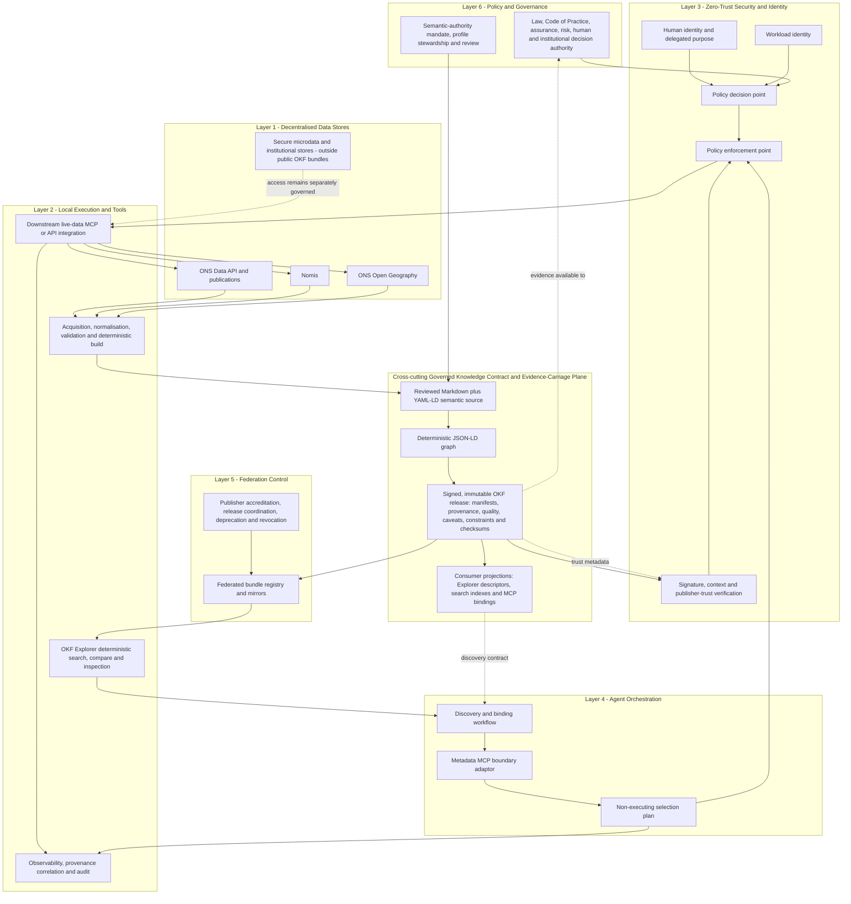
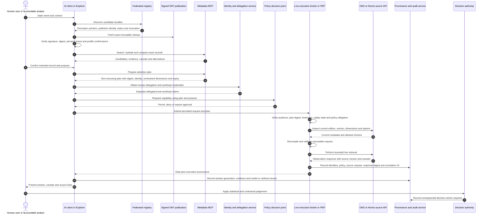

# Document control and research boundary

**Research question.** Where should Open Knowledge Format (OKF), including YAML-LD-based OKF bundles and OKF Explorer, sit within a Governed AI Architecture suitable for UK Government, using the Office for National Statistics (ONS) as the principal reference case?

**Commissioning inputs.** The governing brief was `okf-governed-ai-deep-research-prompt.md`. The baseline architectural input was the 15-slide presentation `Governed_AI_Architecture_(2).pptx`. The presentation was inspected slide by slide and is treated as an architectural proposition, not as normative evidence. The report does **not** imply that ONS, the UK Statistics Authority, the Office for Statistics Regulation, GDS, CDDO, DSIT, NCSC or ICO has endorsed OKF, the reviewed repositories or this architecture.

**Retrieval date.** Web and repository evidence was retrieved on **20 July 2026** unless a source entry states otherwise.

**Evidence classes used throughout.**

- **Normative specification:** requirements or definitions published by a standards body, legislature or competent authority.
- **Experimental application profile:** a profile that narrows or extends a normative base but has not been adopted as a government standard.
- **Repository implementation choice:** behaviour evidenced in source, tests, workflows or generated contracts at an exact commit.
- **Established fact:** directly evidenced by one or more primary sources.
- **Architectural inference:** a reasoned interpretation from established facts.
- **Recommendation:** a design, policy or governance choice that requires accountable adoption.
- **Research claim:** a conclusion of this report, with confidence and falsification conditions stated in section 12.

## Principal repository evidence snapshot

| Repository | Branch | Exact commit examined | Release/version | Retrieval date | Evidential role |
|---|---:|---|---|---|---|
| `https://github.com/GoogleCloudPlatform/knowledge-catalog` | `main` | `d44368c15e38e7c92481c5992e4f9b5b421a801d` | OKF specification **0.1 - Draft**; reference-agent package `0.1.0`; no OKF-specific GitHub release identified | 20 July 2026 | Upstream OKF v0.1 specification and proof-of-concept producer/consumer implementation |
| `https://github.com/chris-page-gov/okf-explorer` | `main` | `c4ecb7e1587597dc45fb8d006617488df1fabc88` | Latest tagged/released identity evidenced in repository: **v0.4.2** (11 July 2026); examined `main` also contains unreleased changes | 20 July 2026 | Experimental YAML-LD Bundle Wiki Profile v1, generic deterministic consumer, registry and conformance tooling |
| `https://github.com/chris-page-gov/okf-ons` | `main` | `af8ff14e9e91b00d7af6b1faa37034f8ecd510fd` | Python package and bundle descriptor **0.1.0**; no GitHub release identified | 20 July 2026 | ONS-centred metadata-only demonstrator, deterministic bundle builder, evaluation harness and metadata MCP broker |

The exact commits are recorded because repository behaviour changed rapidly in July 2026. Repository-derived claims in this report are therefore claims about those commits, not timeless claims about the projects.[^repo-okf][^repo-explorer][^repo-ons]

## Authority and statement taxonomy

This report uses four authority classes that must not be collapsed:

| Authority | Definition | Example in the ONS case | What it does **not** imply |
|---|---|---|---|
| **Source authority** | The institution or system authoritative for the underlying publication, data, classification or service state. | ONS Data API, Nomis, ONS website, ONS Open Geography; for regulated status, UK Statistics Authority/OSR sources. | Authority over an independently produced OKF bundle or over a downstream user's decision. |
| **Semantic authority** | The accountable publisher and reviewers who assert that identifiers, mappings, caveats and interpretations in a particular bundle release mean what the release says they mean. | The organisation publishing and approving an ONS OKF application-profile release. In the present repositories this is not ONS. | Permission to query an API, access secure data, or make a consequential decision. |
| **Operational authority** | The service and policy enforcement chain permitted to perform a live query or action with a defined workload identity and delegated purpose. | An approved ONS/Nomis API integration or live-data MCP service behind policy enforcement. | Statistical fitness, legal basis for the final use, or decision accountability. |
| **Decision authority** | The human or institution accountable for the consequential interpretation or decision. | A statistician, analyst, service owner, caseworker, ministerial or statutory decision-maker, according to context. | That an AI model, bundle or tool call can assume accountability. |

Statements also require four provenance classes:

1. **Official statement:** directly supported by an authoritative source version.
2. **Deterministically normalised statement:** a reproducible transformation of official material, with the source, transformation software and version recorded.
3. **Rule-derived inference:** produced by an explicit rule set, with inputs, rule version, evidence and confidence or validation state.
4. **Model-derived claim:** produced with model assistance, with passage-level evidence, model/method version, confidence, evaluation status and human-review state.

The Explorer profile names these classes, but its present JSON Schema and SHACL shapes do not make the evidence package mandatory. A production profile therefore needs a formal provenance pattern, described in section 6, rather than relying on labels alone.[^explorer-profile][^explorer-schema][^explorer-shacl]

# 1. Executive conclusion

**Recommended placement in one sentence:** UK Government should place OKF as a **cross-cutting Governed Knowledge Contract and Evidence-Carriage Plane, realised through a signed, versioned artefact chain and concrete components in existing layers**, rather than as a seventh architectural layer or a semantic control plane.

The strongest evidence is the combination of what upstream OKF is, what the experimental profiles add, and what the ONS demonstrator actually does. Upstream OKF v0.1 is explicitly a minimal, portable directory of Markdown documents with YAML frontmatter. It requires little more than a `type` field, tolerates unknown fields and broken links, does not define a taxonomy or query infrastructure, and says that it references rather than replaces domain schemas.[^okf-spec] That is strong evidence for H1, the file-format hypothesis, and against attributing governmental control or assurance capability to the format itself. The reviewed Explorer profile then adds YAML-LD authoring, pinned JSON-LD contexts, JSON Schema, SHACL, deterministic projections, authority labels, checksums and a federated descriptor registry; it labels itself an **experimental implementation profile**.[^explorer-profile] The ONS repository adds a further domain-specific chain: bounded acquisition from three official metadata lanes, source-qualified identifiers, deterministic normalisation, explicit coverage ledgers, generated JSON-LD and Explorer artefacts, retrieval evaluation, and a network-free MCP broker that emits a deliberately incomplete, non-executing selection plan.[^ons-source-register][^ons-build][^ons-mcp]

Taken together, the evidence supports neither “OKF is merely a file” nor “OKF controls agents”. The government-relevant value appears at architectural boundaries: a producer can package meaning, source linkage, caveats, quality evidence, constraints and stable identifiers into an inspectable release; a consumer can deterministically discover and compare candidates; and a boundary adaptor can compile a capability request that remains subject to live identity, policy and source validation. This is best described as a **knowledge contract** because it defines what a producer asserts and what a consumer may rely on; and as **evidence carriage** because the bundle can preserve evidence but cannot, by its presence, prove legal compliance, statistical accuracy, authorisation or fitness for a consequential use.

The principal limitation is maturity and authority. OKF v0.1 is a draft, permissive convention; YAML-LD was a W3C Working Draft on the research date, not a Recommendation; the Bundle Wiki Profile is local and experimental; and the reviewed releases lack a complete cross-government publisher trust, signature, revocation and conformance regime.[^yaml-ld][^explorer-profile] Mature standards already cover substantial parts of the problem: DCAT 3 for catalogue federation, PROV-O for provenance, SDMX and DDI for statistical structures, SHACL for graph constraints, OpenAPI/Arazzo for interfaces and workflows, OAuth/OIDC and policy engines for access, and supply-chain frameworks for artefact integrity. OKF must compose these standards rather than claim to replace them.

OKF must **not** be mistaken for a source of observation truth; an access-control or policy-decision system; an identity provider; a live execution broker; a statistical-quality certificate; a compliance certificate; a replacement for SDMX, DDI, DCAT or OpenAPI; or a decision-maker. A schema-valid selection plan is still not authorised execution. The ONS/Nomis/source systems remain source authorities; an approved bundle publisher becomes semantic authority only for its release; a separate trusted service holds operational authority; and accountable humans or institutions retain decision authority.

The decision UK Government should take now is to treat the pattern as an **experimental cross-government interoperability pattern and discovery/evidence packaging convention**, with `okf-ons` and OKF Explorer as reference implementations, not as a mandated standard or an ONS-endorsed architecture. Commission a 90-day ONS-centred pilot that fixes authority attribution, signs releases, pins contexts by digest, binds selection plans to bundle and API versions, applies independent policy enforcement, and measures whether users and agents select the correct statistical product more reliably. Progress to an endorsed interoperability profile only after at least two independent producer implementations and two independent consumers demonstrate round-trip semantic compatibility, trust and revocation controls, measurable public value, and acceptable adoption cost.

# 2. Established facts, architectural inferences and recommendations

## 2.1 Established facts

### Normative OKF and standards facts

1. OKF v0.1 is labelled **Version 0.1 - Draft**. It defines a bundle as a directory tree of Markdown concept documents with YAML frontmatter; only `type` is required by the normative conformance section, while unknown fields, missing optional fields and broken links are to be tolerated.[^okf-spec]
2. OKF v0.1 declares non-goals that include prescribing storage, serving or query infrastructure and replacing domain-specific schemas. It does not specify publisher identity, signatures, revocation, access control, statement-level provenance, typed relationships or execution semantics.[^okf-spec]
3. The upstream reference-agent implementation is stricter than the specification: its local validator requires `type`, `title`, `description` and `timestamp`. That is an implementation choice, not a normative OKF v0.1 requirement.[^okf-document]
4. YAML-LD 1.0 was a W3C **Working Draft dated 21 May 2026** on the retrieval date; W3C Working Draft publication does not imply endorsement or Recommendation status.[^yaml-ld]
5. JSON-LD 1.1, PROV-O, SHACL, SKOS, CSV on the Web and DCAT 3 have mature W3C statuses and should be treated as external semantic foundations, not as features created by OKF.[^json-ld][^prov-o][^shacl][^skos][^csvw][^dcat]

### Experimental profile facts

6. The Explorer Bundle Wiki Profile v1 describes itself as an **experimental implementation profile** dated 11 July 2026. It designates `okf-bundle.yamlld` as the canonical semantic descriptor, publishes deterministic JSON-LD and Explorer projections, requires a manifest, a pinned context copy and checksums, and distinguishes official, normalised, inferred and model-derived statements.[^explorer-profile]
7. The Explorer semantic parser uses YAML 1.2 safe parsing, rejects duplicate keys and non-finite values, and uses an allowlisted local JSON-LD document loader; arbitrary remote contexts are rejected during expansion.[^explorer-parser][^explorer-tests]
8. The profile's current JSON Schemas require core identity and description fields but permit arbitrary additional properties. Its SHACL shapes are minimal and do not require authority class, evidence, confidence, source version, transformation activity or review state.[^explorer-schema][^explorer-shacl]
9. The current registry is a curated YAML-LD source that points to independently published bundle descriptors. It contains publisher and licence pointers, but it does not itself evidence cryptographic publisher authentication, trust tiers, expiry, compromise response or revocation semantics.[^explorer-registry]
10. The Explorer implements deterministic static retrieval, bounded resource loading and, for an optional same-origin range-pack transport, exact byte ranges and SHA-256 verification. These controls improve integrity and availability but are not publisher signatures.[^explorer-architecture][^explorer-fetch][^explorer-range]

### ONS implementation facts

11. At the examined commit, `okf-ons` freezes 4,989 metadata records: 337 from the ONS Data API, 1,617 from Nomis and 3,035 from ONS Open Geography. The snapshot declares metadata-only scope, excludes observations and records SHA-256 digests and per-lane counts.[^ons-snapshot]
12. The source register excludes observation values, secure or controlled microdata, binary downloads, full geometries, credentials, cookies and request-specific personal information. It distinguishes implemented source lanes from planned reconciliation lanes.[^ons-source-register]
13. The build fails closed on frozen-source hash mismatch, normalised-record count mismatch and unsafe output paths; it produces deterministic canonical JSON, per-file checksums and a root checksum; and it compares a publication directory with a fresh deterministic rebuild.[^ons-build]
14. The coverage ledger disables an “all ONS metadata” claim and records five planned reconciliation lanes without closed denominators. It warns that source counts are catalogue representations, not unique statistical-product counts.[^ons-coverage]
15. The evaluation harness measures retrieval and evidence exposure - including Recall@k, MRR, nDCG, alternative exposure and contrast coverage - while explicitly declining to measure statistical accuracy, methodological correctness or user interpretation.[^ons-evaluation]
16. The metadata MCP broker has no network or live-query code. Its plan records fixed identity arguments, unresolved dimensions, conflicts, live-validation status and `executed: false`; tests verify that plans remain incomplete and non-executing.[^ons-mcp][^ons-mcp-tests]
17. The build currently emits `okf-bundle.jsonld` and a byte-stable `okf-bundle.yamlld` whose content is JSON (valid YAML 1.2), rather than a curated Markdown-plus-YAML-LD semantic authoring corpus. This is an important divergence from the proposed authoring model.[^ons-build-semantic]
18. The generated semantic bundle maps `publisher` to `https://www.ons.gov.uk/`, while the Explorer descriptor separately names the bundle publisher as `https://github.com/chris-page-gov`. Without explicit predicates for source publisher and bundle publisher, that difference creates a material risk of implying ONS authorship or endorsement.[^ons-build-semantic]
19. The current GitHub Pages workflows run tests and deterministic checks, but artefacts are not shown as signed envelopes, provenance attestations or releases bound to an authenticated publisher key; workflow actions are referenced by mutable major tags rather than immutable action commit SHAs.[^ons-pages][^explorer-pages]
20. The MCP broker declares protocol version `2025-06-18`, while the current MCP specification on the retrieval date was `2025-11-25`; compatibility and security review are therefore required before production use.[^ons-mcp][^mcp-current]

### UK Government and official-statistics facts

21. The Code of Practice for Statistics 3.0 was released on 30 October 2025 and organises its standards around Trustworthiness, Quality and Value. The presence of metadata cannot establish compliance with the Code or the accuracy of an observation.[^code-3]
22. The UK Government AI Playbook, Data and AI Ethics Framework, Algorithmic Transparency Recording Standard, Technology Code of Practice, Open Standards Principles and Digital Assurance Playbook apply in different scopes and with different force. None makes OKF mandatory.[^ai-playbook][^ethics-framework][^atrs][^tcop][^open-standards][^digital-assurance]
23. NCSC guidance treats secure AI as a lifecycle responsibility spanning secure design, development, deployment, maintenance and incident handling, including supply-chain security, logging, threat modelling and protection against model-facing malicious input.[^ncsc-ai]
24. UK GDPR and the Data Protection Act 2018 remain relevant when personal data is processed; the Data (Use and Access) Act 2025 amended parts of the regime. Metadata fields and audit logs do not in themselves establish lawfulness, fairness, necessity or proportionality.[^data-protection][^duaa]

## 2.2 Architectural inferences

1. **OKF is simultaneously a format and a boundary contract, but only through a governed profile.** Upstream OKF supports portability and human review; the contract and evidence-plane properties arise from additional profile rules, institutional governance and trustworthy publication.
2. **The best architectural representation is hybrid.** A cross-cutting plane communicates the recurring semantic and evidence concerns, while concrete artefacts and services must still appear in the six existing layers. A plane without components is vague; components without a plane conceal lifecycle-wide responsibilities.
3. **“Evidence-carriage” is more accurate than “evidence” alone.** A bundle can preserve provenance, quality notes and assurance artefacts, but cannot convert those into compliance, authorisation or statistical validity.
4. **“Control plane” is presently inaccurate.** The reviewed bundles inform and constrain selection but do not authenticate actors, decide policy, enforce access, perform live retrieval or make decisions. Calling them a control plane would conflate semantic guidance with control.
5. **The selection plan is best understood as a compiler output and capability request.** It binds a human- or agent-selected semantic identity to a proposed tool and arguments, while remaining non-executable until revalidated and authorised by a separate broker.
6. **Canonicality is plural and role-specific.** The source system is canonical for source data and source publication state; the reviewed semantic source is canonical for a bundle release; expanded JSON-LD is a deterministic semantic projection; Explorer indexes and MCP plans are runtime projections. Calling any one of these “the single source of truth” would be misleading.
7. **Keeping observations and secure data outside the bundle reduces risk but introduces freshness dependency.** It lowers privacy, credential, exfiltration and stale-copy risks, while raising the importance of metadata refresh, tombstones, version binding and live revalidation.
8. **A registry should be a trust-aware pointer service, not a universal warehouse.** Independent publication preserves institutional ownership and cadence; a central registry becomes a centralisation trap if it copies corpora, becomes the sole resolver, or silently adjudicates conflicts.

## 2.3 Recommendations

1. Adopt the label **Governed Knowledge Contract and Evidence-Carriage Plane** for the pattern. In executive diagrams, shorten it to **Governed Knowledge Contract Plane**, with a legend stating that it carries evidence but does not certify or authorise.
2. Do not add a seventh numbered layer. Show the plane across layers 1-6 and place its concrete components in their operational homes.
3. Define a UK Government experimental profile that composes OKF with JSON-LD, PROV-O, DCAT 3, SHACL, domain standards and signed-envelope/supply-chain standards. Do not fork the meaning of those standards.
4. Correct the ONS demonstrator's authority model before any formal pilot: distinguish `sourcePublisher`, `bundlePublisher`, `semanticAuthority`, `reviewedBy` and a prominent `notEndorsedBySource` statement where applicable.
5. Require signed, immutable release snapshots; a digest-bound context set; publisher identity and key lifecycle; registry revocation; and a verifiable build attestation. Checksums alone are insufficient.
6. Treat Markdown, contexts, links, descriptors, registry entries and model-facing text as untrusted input. Render with sanitisation, prohibit active content, constrain protocols and origins, and isolate model consumption from system instructions and tool authority.
7. Require every live execution broker to re-resolve source state, validate edition/version/dimensions/options, evaluate policy, verify human delegation and workload identity, and issue a new audit-correlated execution record. It must never execute a selection plan merely because it is schema-valid.
8. Commission the staged pilot in section 11 and make progression contingent on measurable selection quality, interoperability, trust, security and operational criteria rather than on repository feature completeness.

# 3. Placement-options assessment

## 3.1 Decision criteria and weights

The matrix tests architectural placement, not the intrinsic quality of OKF. Scores use a five-point scale: 1 = materially poor, 3 = acceptable with significant conditions, 5 = strong. Weighted totals are converted to a score out of 100.

| Criterion | Weight | Reason for weight |
|---|---:|---|
| Public value | 8 | The architecture must improve discoverability, correct selection, accountability or service outcomes. |
| Semantic precision | 9 | Official statistics and cross-department use fail when identifiers, versions and meanings are ambiguous. |
| Provenance and evidence | 10 | Government adoption requires traceable source, derivation, caveat and assurance evidence. |
| Determinism and human auditability | 9 | Reproducibility, diffability and review are central to the proposed value. |
| Machine actionability | 7 | The pattern must support tools and agents without giving them unauthorised power. |
| Interoperability and vendor neutrality | 10 | Cross-government value depends on standards composition and independent implementations. |
| Federation | 9 | The baseline architecture assumes independently governed organisations and data stores. |
| Authority separation, privacy and security | 12 | Conflating discovery with authority or execution would create severe risk. |
| Operational resilience and lifecycle | 8 | Refresh, deprecation, recovery, versioning and incident response determine production viability. |
| Adoption cost | 8 | A conceptually elegant pattern that duplicates existing standards at high cost should not be adopted. |
| Standards maturity | 6 | Early standards can be piloted, but maturity affects mandates and procurement. |
| Architectural clarity | 4 | The representation must help boards allocate ownership and boundaries. |
| **Total** | **100** | |

## 3.2 Weighted placement matrix

| Placement option | Public value | Semantic precision | Provenance | Determinism/audit | Machine action | Interoperability | Federation | Authority/privacy/security | Resilience/lifecycle | Adoption cost | Maturity | Clarity | Weighted score /100 | Assessment |
|---|---:|---:|---:|---:|---:|---:|---:|---:|---:|---:|---:|---:|---:|---|
| Seventh architectural layer | 4 | 4 | 4 | 4 | 3 | 3 | 4 | 3 | 3 | 2 | 2 | 4 | **63.8** | Visually prominent but overstates maturity and risks layer duplication. |
| Component within data layer | 3 | 3 | 3 | 4 | 2 | 4 | 3 | 4 | 4 | 4 | 4 | 3 | **66.8** | Appropriate for catalogue artefacts, but hides cross-layer evidence and execution-boundary concerns. |
| Component within agent orchestration | 3 | 3 | 2 | 3 | 5 | 3 | 3 | 2 | 3 | 3 | 3 | 3 | **58.4** | Overweights agent use and encourages conflation with control and execution. |
| Cross-cutting Governed Knowledge Contract and Evidence-Carriage Plane | 5 | 5 | 5 | 5 | 4 | 5 | 5 | 5 | 4 | 2 | 2 | 5 | **87.4** | Best conceptual account, but can become vague or overclaim evidence if not tied to components and controls. |
| Artefact chain with no separate plane | 4 | 5 | 4 | 5 | 4 | 5 | 4 | 4 | 5 | 4 | 4 | 4 | **82.8** | Strong engineering model and low architecture inflation; weaker at making cross-cutting ownership visible. |
| **Hybrid: plane plus concrete components and artefact chain** | **5** | **5** | **5** | **5** | **5** | **5** | **5** | **5** | **5** | **3** | **3** | **5** | **94.6** | **Recommended.** It combines architectural visibility with testable artefacts, interfaces and non-responsibilities. |

### Interpretation

The hybrid wins because the plane and the artefact chain solve different problems. The plane tells an architecture board that semantic authority, evidence, versions and constraints recur across the whole system. The artefact chain tells engineering and assurance teams exactly what is built, signed, published, discovered, compiled, authorised, executed and audited. The score does **not** imply that “plane” is an upstream OKF term or a normative standard.

## 3.3 Sensitivity analysis

The ranking remains stable under three alternative priorities. Scores below are weighted totals out of 100 after changing the weights while retaining the same underlying option scores.

| Scenario | Seventh layer | Data component | Orchestration component | Cross-cutting plane | Artefact chain only | Hybrid |
|---|---:|---:|---:|---:|---:|---:|
| Base weights | 63.8 | 66.8 | 58.4 | 87.4 | 82.8 | **94.6** |
| Cost and standards maturity prioritised | 58.8 | 69.8 | 58.8 | 80.0 | 84.8 | **90.4** |
| Security, evidence and federation prioritised | 67.0 | 66.0 | 55.6 | 91.8 | 82.6 | **97.4** |
| Agent automation prioritised | 62.8 | 63.4 | 63.8 | 86.8 | 80.2 | **93.6** |

The artefact-chain-only option comes closest when adoption cost and standards maturity dominate. This is the principal practical alternative. A board that rejects “plane” terminology can adopt the same substantive architecture as a **governed knowledge-contract artefact chain spanning existing planes**, provided cross-cutting ownership is still explicit.

## 3.4 Competing hypotheses

The following table scores the eight required hypotheses across 14 criteria. A score of 5 means the hypothesis explains or supports the criterion strongly; 1 means it explains it poorly or introduces material risk.

| Hypothesis | Public value | Semantic precision | Provenance | Determinism | Human audit | Machine action | Interop | Federation | Privacy | Security | Resilience | Adoption cost | Maturity | Vendor neutral | Mean /5 |
|---|---:|---:|---:|---:|---:|---:|---:|---:|---:|---:|---:|---:|---:|---:|---:|
| H1 File-format | 3 | 2 | 1 | 4 | 5 | 2 | 4 | 3 | 4 | 3 | 4 | 5 | 5 | 5 | **3.57** |
| H2 Knowledge-contract | 5 | 4 | 4 | 5 | 5 | 4 | 5 | 4 | 4 | 4 | 4 | 3 | 3 | 5 | **4.21** |
| H3 Evidence-plane | 5 | 4 | 5 | 4 | 5 | 3 | 4 | 5 | 5 | 5 | 4 | 3 | 2 | 5 | **4.21** |
| H4 Semantic-control-plane | 3 | 4 | 3 | 4 | 3 | 5 | 4 | 4 | 2 | 2 | 3 | 2 | 2 | 4 | **3.21** |
| H5 Federated-publication | 4 | 4 | 4 | 4 | 4 | 3 | 5 | 5 | 5 | 4 | 4 | 3 | 3 | 5 | **4.07** |
| H6 RAG-packaging | 3 | 2 | 3 | 3 | 4 | 4 | 3 | 2 | 3 | 2 | 3 | 4 | 3 | 4 | **3.07** |
| H7 Compilation-target | 5 | 5 | 5 | 5 | 5 | 5 | 5 | 4 | 4 | 4 | 5 | 3 | 3 | 5 | **4.50** |
| H8 Boundary-contract | 5 | 5 | 5 | 5 | 5 | 5 | 4 | 4 | 5 | 5 | 5 | 3 | 3 | 5 | **4.57** |

### H1 - File-format hypothesis

**Evidence for.** Upstream OKF describes itself as a minimal Markdown and YAML-frontmatter format, deliberately avoids central authority and query infrastructure, and has permissive conformance.[^okf-spec] Its portability, Git diffability and low adoption cost are genuine advantages.

**Evidence against.** Government value in the reviewed repositories arises from application-profile semantics, deterministic builds, source and coverage ledgers, provenance, generated contracts, Explorer behaviour and boundary plans. Treating these as “just files” obscures institutional promises and lifecycle obligations.

**Judgement.** True at the upstream specification level; insufficient as the complete architecture.

### H2 - Knowledge-contract hypothesis

**Evidence for.** A versioned bundle can state stable identities, meanings, caveats, source links, compatibility and constraints for consumers. The ONS implementation's explicit scope, denominator, source-qualified identity and non-execution boundary are contract-like.[^ons-source-register][^ons-mcp]

**Evidence against.** OKF v0.1 has no normative contract vocabulary, conformance levels or remedies. The contract exists only when a profile and governance regime make claims testable and accountable.

**Judgement.** Strong, if phrased as a **governed application-profile contract**, not an intrinsic property of any OKF directory.

### H3 - Evidence-plane hypothesis

**Evidence for.** Provenance, source hashes, coverage, caveats, evaluation reports, checksums and standards mappings are major public-sector differentiators. The separation of metadata evidence from statistical accuracy is particularly valuable.[^ons-coverage][^ons-evaluation]

**Evidence against.** Evidence can be absent, misleading, stale or self-asserted. A bundle cannot confer compliance, assurance or official status. “Evidence plane” alone encourages this category error.

**Judgement.** Strong only with the qualifying term **evidence-carriage** and external assurance.

### H4 - Semantic-control-plane hypothesis

**Evidence for.** Stable semantics can constrain candidate selection and reduce ambiguous tool calls. Registries and selection plans can influence agent behaviour.

**Evidence against.** The reviewed components do not authenticate, authorise, enforce or execute. MCP itself warns that tool annotations are untrusted and requires access control, validation, user confirmation and audit outside descriptive metadata.[^mcp-current] Calling the bundle a control plane would blur the discovery/execution boundary identified by the presentation.

**Judgement.** Rejected for the current architecture. “Semantic coordination plane” may be defensible later, but “control plane” is not.

### H5 - Federated-publication hypothesis

**Evidence for.** The Explorer architecture deliberately moves production bundles into independently versioned publications and makes the registry a pointer catalogue. DCAT 3 also supports federated catalogue patterns.[^explorer-architecture][^dcat]

**Evidence against.** The current registry has no cross-institution trust framework, conflict protocol, publisher accreditation or revocation. Federation is a deployment pattern, not the whole value proposition.

**Judgement.** Strong secondary hypothesis and a necessary feature of the recommended plane.

### H6 - RAG-packaging hypothesis

**Evidence for.** Markdown, progressive disclosure, search shards and inspectable text can support retrieval-augmented generation and reduce opaque ingestion.

**Evidence against.** The ONS architecture deliberately supports deterministic human and agent discovery without requiring embeddings or an LLM. Framing OKF chiefly as RAG packaging underplays identifiers, authority, versioning, federation and the execution boundary; it also risks prompt injection from trusted-looking metadata.

**Judgement.** A useful consumption mode, not the primary placement.

### H7 - Compilation-target hypothesis

**Evidence for.** The Explorer profile explicitly treats YAML-LD as semantic source and JSON-LD/Explorer artefacts as deterministic projections. The ONS build demonstrates deterministic projections, manifests, search shards and checksums.[^explorer-profile][^ons-build-semantic]

**Evidence against.** Current `okf-ons` does not yet have a rich human-curated Markdown/YAML-LD source corpus; its YAML-LD is generated from JSON-shaped records. YAML-LD remains a Working Draft and authoring-tool interoperability is unproven.

**Judgement.** Very strong target architecture, conditional on round-trip and usability evidence.

### H8 - Boundary-contract hypothesis

**Evidence for.** The metadata MCP plan binds identity and expected tools while explicitly recording unresolved dimensions and `executed: false`. That is precisely the boundary at which semantic selection can be inspected before identity, policy and live source validation.[^ons-mcp-tests]

**Evidence against.** A plan can become stale, replayed or mistaken for a command. Its value depends on cryptographic binding, expiry, live revalidation, policy enforcement and audit correlation, none of which is complete in the demonstrator.

**Judgement.** Strongest individual hypothesis; implement as a non-executing compiler output and capability request.

## 3.5 Strongest case against the recommended placement

A sceptical architecture board could reasonably argue:

- Upstream OKF is too permissive and too immature to justify architectural-plane status.
- YAML-LD is a Working Draft and the profile has one principal implementation family.
- DCAT, PROV-O, SDMX, DDI, OpenAPI, SHACL and established catalogues already cover most concerns.
- A new plane adds vocabulary, governance and procurement cost while masking that the deliverables are ordinary signed files, catalogues and policy-controlled APIs.
- “Evidence” language may create false assurance, especially where the current implementation derives alignment labels from field presence.
- The demonstrated public value has not been established through representative ONS users, independent statistical review or production incidents.

This report accepts the substance of that challenge. The recommendation survives only because the proposed plane is **not** a new normative standard or execution tier: it is an enterprise-architecture view of a standards-composed artefact chain. The board may adopt the artefact-chain-only representation without changing the controls.

## 3.6 Evidence that would falsify the recommendation

The recommended placement should be abandoned or materially revised if any of the following is demonstrated:

1. Independent pilots show no measurable improvement over a well-implemented DCAT/SDMX/OpenAPI catalogue in correct dataset selection, exposure of alternatives, provenance comprehension or safe hand-off.
2. Two independent producers and consumers cannot round-trip the same semantic bundle without meaning-changing differences.
3. Runtime projections become the de facto authority and cannot be deterministically regenerated from a reviewed semantic source.
4. The cost of source reconciliation, signing, refresh, review and registry governance exceeds the value for realistic departmental use.
5. Selection plans materially increase mistaken or unauthorised execution, or cannot be bound to source and policy state with acceptable reliability.
6. Mature standards add equivalent portable, human-auditable packaging and boundary semantics with lower complexity.
7. Users or agents systematically treat evidence presence as official endorsement, compliance or statistical fitness despite controls.

# 4. Architecture diagrams and six-layer placement

The presentation's six-layer model is retained. OKF does not become layer 7. The diagrams add a cross-cutting contract/evidence-carriage view and locate every concrete component in an existing layer. The diagrams use conservative Mermaid syntax and can be rendered by Mermaid-compatible tooling.

## 4.1 Six-layer model with proposed placement

### Placement interpretation

- **YAML-LD semantic source and bundle compilation** are local execution/build concerns in layer 2, governed by layer 6 and carrying knowledge-plane semantics across the architecture.
- **The signed bundle release** is an artefact crossing layers 2, 3, 5 and 6: built locally, verified as supply-chain material, published federatively and governed institutionally.
- **The registry** is layer 5. It is a pointer and trust-metadata service, not source authority and not a corpus warehouse.
- **Explorer** is primarily a deterministic knowledge-plane consumer and presentation/retrieval component in layer 2. It may participate in layer-4 discovery workflows, but it does not orchestrate live actions.
- **Metadata MCP** is in layer 4 as a boundary adaptor. It reads a fixed semantic release and compiles a proposed plan; it does not hold policy or live-data authority.
- **Downstream live-data MCP/API** is layer 2 behind layer-3 enforcement. It validates current source state and performs authorised retrieval.
- **Human and workload identities, policy and signatures** remain in layer 3. A bundle may carry policy references and required capabilities but cannot replace a PDP or PEP.
- **Decision authority, legal basis, statistical judgement and accountability** remain in layer 6.

## 4.2 ONS component and data-flow architecture

```mermaid
flowchart LR
  subgraph SA["Source authorities - Layer 1"]
    OA["ONS Data API"]
    NM["Nomis"]
    OG["ONS Open Geography"]
    PUB["ONS publications, methods, quality and classifications"]
  end

  subgraph BUILD["Controlled production - Layer 2"]
    A["Acquisition records: URLs, time, response hashes, counts and failures"]
    N["Deterministic normalisation: source-qualified IDs, editions, versions and dimensions"]
    H["Human review and semantic authoring: Markdown plus YAML-LD"]
    V["Schema, SHACL, source, coverage, link and policy validation"]
    C["Deterministic compilation"]
  end

  subgraph RELEASE["Immutable release surfaces"]
    JL["Expanded JSON-LD"]
    EXD["Explorer descriptor and static search/facet/relationship indexes"]
    MAN["Manifest, coverage ledger, evaluation and checksums"]
    MB["MCP binding metadata"]
    SIG["DSSE or equivalent signature and provenance attestation"]
  end

  subgraph FEDPUB["Federated publication - Layers 3 and 5"]
    HOST["Independent bundle publication"]
    R["Registry or mirror pointers, status and revocation"]
  end

  subgraph DISCOVERY["Discovery - Layers 2 and 4"]
    E["OKF Explorer"]
    M["Metadata MCP"]
    P["Inspect-only selection plan: bundle digest, record ID, proposed capability, unresolved choices and expiry"]
  end

  subgraph EXEC["Authorised execution - Layers 2 and 3"]
    I["Human delegation plus workload identity"]
    PD["Policy decision and enforcement"]
    D["Downstream ONS or Nomis integration"]
    Q["Live version, dimension and option validation"]
  end

  subgraph EVIDENCE["Governance, evidence and assurance - Layer 6"]
    AU["Audit correlation: discovery, plan, authorisation, execution and answer"]
    EV["Evaluation, incident, refresh and assurance records"]
    HD["Human or institutional decision authority"]
  end

  OA --> A
  NM --> A
  OG --> A
  PUB --> A
  A --> N
  N --> H
  H --> V
  V --> C
  C --> JL
  C --> EXD
  C --> MAN
  C --> MB
  JL --> SIG
  EXD --> SIG
  MAN --> SIG
  MB --> SIG
  SIG --> HOST
  HOST --> R
  R --> E
  HOST --> E
  HOST --> M
  E --> M
  M --> P
  P --> PD
  I --> PD
  PD --> D
  D --> Q
  Q --> OA
  Q --> NM
  Q --> OG
  Q --> AU
  P --> AU
  PD --> AU
  AU --> EV
  AU --> HD
  MAN --> EV
```

The target authoring box is deliberately labelled **human review and semantic authoring**. The current `okf-ons` build proves deterministic compilation but does not yet prove that a rich Markdown/YAML-LD source is practical for 4,989 records. The pilot should test a mixed model: curated semantic contracts for high-value concepts and generated, reviewable metadata projections for high-volume records.

## 4.3 Trust-boundary sequence: discovery to live retrieval and audit

The critical security property is that the plan crosses the boundary as **input to authorisation**, not as evidence that authorisation has already occurred. The broker creates or validates the executable command only after current source inspection and policy enforcement.

## 4.4 Bundle lifecycle from source to deprecation

```mermaid
flowchart LR
  S0["1 Authoritative source register and scope"] --> S1["2 Acquisition"]
  S1 --> S2["3 Normalisation"]
  S2 --> S3["4 Semantic authoring and review"]
  S3 --> S4["5 Validation and conformance"]
  S4 --> S5["6 Compilation and evaluation"]
  S5 --> S6["7 Signing and immutable release"]
  S6 --> S7["8 Independent publication"]
  S7 --> S8["9 Registry admission and discovery"]
  S8 --> S9["10 Binding and selection planning"]
  S9 --> S10["11 Authorisation and live execution"]
  S10 --> S11["12 Audit and outcome evaluation"]
  S11 --> S12["13 Refresh decision"]
  S12 -->|"source or semantic change"| S1
  S12 -->|"still current"| S8
  S12 -->|"superseded"| S13["14 Deprecation and revocation"]
  S13 --> S14["15 Archival and records retention"]
  S14 -. "retained evidence and migration pointer" .-> S8

  F1["Acquisition failure or denominator gap"] -.-> S1
  F2["Validation or evaluation failure"] -.-> S3
  F3["Signature or publication compromise"] -.-> S13
  F4["Execution mismatch or incident"] -.-> S11
```

Every arrow carries an evidence obligation. Section 8.3 provides the lifecycle owner, evidence, failure and recovery matrix; section 11 provides stage-gate exit criteria.

# 5. Responsibility and authority matrix

The table is deliberately explicit about **what each component cannot do**, because non-responsibilities are the main defence against conflating discovery, semantics, authorisation, execution and decision authority.

| Component or artefact | Layer and plane | Accountable owner | Source authority | Semantic authority | Operational authority | Decision authority | Inputs and outputs | Security classification | Applicable policy/standards | Evidence produced | Explicitly cannot do |
|---|---|---|---|---|---|---|---|---|---|---|---|
| ONS Data API / publication | L1 source-data plane | ONS service/publication owner | ONS | ONS for source terms and publication meaning | ONS service operator | None by itself | Official metadata/observations out | Public or as designated | Code of Practice, API terms, records duties | Publication/version identifiers, source response | Endorse third-party bundle; authorise downstream purpose; make user's decision |
| Nomis | L1 source-data plane | Nomis/ONS service owner | ONS/Nomis according to product | ONS/Nomis for source representation | Nomis operator | None | SDMX-style metadata and observations | Public for open API | Code, SDMX where used, service controls | Dataset, dimension and codelist responses | Establish equivalence with a separate ONS API representation without evidence |
| ONS Open Geography | L1 source-data plane | ONS geography service owner | ONS | ONS for official geography product metadata | ONS service operator | None | Catalogue/product metadata, services, files | Public for open products | Geography standards, API/OGC contracts, OGL | Product IDs, vintages, service links | Grant secure-data access; guarantee that a map preview is an authoritative boundary |
| Secure microdata environment | L1 source/security planes | Data owner and accredited research service | Data controller/owner | Statistical and data-governance authorities | Accredited service | Accredited researcher/institution | Controlled data and outputs | OFFICIAL-SENSITIVE or as assessed | Five Safes, DEA, UK GDPR, DPA | Access decisions, disclosure-control evidence | Be represented as a public OKF payload; expose row-level data or credentials |
| Source register and scope definition | L6 governance plus knowledge plane | Bundle product owner | Named upstream sources | Bundle semantic authority | None | Scope approver | Source lanes, denominators, exclusions | Usually public; internal constraints may be restricted | Open Standards, Code, records management | Approved scope, denominator method, exclusions | Claim source completeness without measurement; change upstream truth |
| Acquisition record | L2 local execution/source plane | Data pipeline owner | Upstream source | Bundle semantic authority for recorded extraction | Acquisition workload only | None | HTTP/API response metadata to immutable acquisition evidence | According to source; no secrets in public release | NCSC secure development, provenance | URL, time, response/status, hash, counts, failures | Interpret statistical meaning; silently omit failed pages |
| Deterministic normalisation | L2 knowledge plane | Semantic engineering owner | Upstream remains source authority | Bundle semantic authority for mapping | Build workload only | None | Source records to canonical IDs and fields | Normally public | PROV-O, SKOS, domain profiles | Rule/software version, input/output hashes, exceptions | Convert an inference into an official statement; silently merge conflicts |
| Markdown plus YAML-LD semantic source | L2 knowledge plane governed by L6 | Semantic product owner and reviewers | Referenced sources | **Primary semantic authority for bundle release** | None | None | Reviewed assertions and caveats to compilable graph | Public unless profile is internal | YAML-LD, JSON-LD, PROV-O, SHACL, DCAT/SDMX/DDI mappings | Review approvals, changes, source references | Authorise API access; certify compliance or statistical fitness |
| Expanded JSON-LD graph | L2 knowledge plane | Build owner | As referenced | Inherits only from reviewed semantic source and build | None | None | YAML-LD to deterministic RDF/JSON-LD projection | Same as source | JSON-LD 1.1, RDF, PROV-O | Expansion result, context digest, build digest | Become a separate semantic authority; fetch arbitrary contexts at runtime |
| Manifest, coverage and quality evidence | L2/L6 evidence plane | Bundle product and assurance owners | Referenced sources | Bundle semantic authority for measurement definition | None | None | Counts, denominators, metrics, caveats | Public unless operational detail restricted | Code 3.0, DQV analogy, evaluation method | Measured coverage, omissions, test results | Prove statistical accuracy, lawfulness or fitness merely by field presence |
| Signed OKF release | L2/L3/L5 knowledge, trust and federation planes | Publisher release authority | No change to source authority | Authenticated publisher for exact release | None | None | Immutable artefact set to signed envelope | Public for open bundle | DSSE/in-toto/SLSA, OGL, records | Signature, digest, build provenance, SBOM | Prove truth of signed content; prevent an authorised publisher making a bad claim |
| Independent bundle host | L2/L5 management plane | Publisher service owner | None | Serves declared release | Hosting authority only | None | Release bytes out | Public | Service standard/operability, HTTP security | Availability, headers, release retention | Become sole registry or copy private corpora by default |
| Federated registry | L5 federation/management plane | Registry governing body | None | Curates trust statements and pointers, not bundle contents | Registry service operator | None | Publisher entries, descriptors, status, revocation | Public with restricted admin plane | DCAT federation analogy, trust framework | Admission decision, status history, revocation event | Endorse source content silently; resolve semantic conflicts as if they did not exist |
| OKF Explorer | L2 knowledge/presentation plane | Explorer product owner | None | None; consumes declared semantics | Read-only client execution | User remains responsible | Descriptors/indexes to deterministic search, filters, comparisons and source views | Public client; local state | Accessibility, secure rendering, deterministic evaluation | Query state, selected release/record, comparison evidence | Authorise, execute live data queries, declare statistical equivalence, sanitise semantics by ranking |
| Metadata MCP | L4 orchestration boundary | Metadata service owner | None | Consumes exact bundle release | Read-only metadata capability | User/institution | Search/hydrate/compare inputs to selection plan | Public metadata; no secrets | MCP tools, input validation, audit | Tool calls, bundle digest, selected identity, unresolved choices | Network retrieval of observations; accept credentials; execute plan; grant authority |
| Selection plan | L4 knowledge/control boundary artefact | Requesting workflow owner | None | Derived from bundle release | None until accepted by broker | None | Bundle/record/purpose to inspect-only capability request | May contain user purpose; classify accordingly | JSON Schema, capability request contract | Plan ID, digest, expiry, unresolved fields | Act as a bearer token or executable command; survive source/version change without validation |
| Human identity and delegation | L3 security/trust plane | Identity and service owner | None | None | Establishes delegated principal/purpose claims | Supports but does not replace decision authority | Authentication and consent/mandate to delegated claims | Sensitive identity data | OIDC/OAuth, DPoP where appropriate | Authentication, delegation, consent/mandate event | Be copied into public bundle; be inferred from workload identity |
| Workload identity | L3 security/trust plane | Platform/security owner | None | None | Authenticates service workload | None | Workload attestation to token/certificate | Sensitive security material | SPIFFE/SPIRE or equivalent | Workload attestation, token audience | Impersonate human intent or decision authority |
| PDP and PEP | L3 control/security plane | Policy owner and service operator | None | Interprets policy bindings | **Operational authorisation** | None | Identity, purpose, resource, risk and obligations to permit/deny | Sensitive policy and audit data | OPA or equivalent, OAuth resource indicators | Decision ID, policy version, obligations, enforcement result | Establish statistical fitness or final decision legitimacy |
| Downstream live-data MCP/API broker | L2 execution plus L3 enforcement | Live integration service owner | Source remains ONS/Nomis | Uses bundle semantics but revalidates source | **Operational authority for bounded query** | None | Authorised plan plus live metadata to source request and response | According to data; public or restricted | OpenAPI/SDMX/MCP, service controls, rate limits | Exact request/response metadata, source version, timing | Execute stale plan without revalidation; broaden purpose; make consequential decision |
| Provenance/observability/audit service | L2/L6 evidence plane | Assurance and records owner | None | Records assertions from systems | Audit service authority | Supports accountable owner | Correlated events and digests | Often sensitive; retention controlled | OpenTelemetry, PROV-O mapping, records duties | End-to-end trace and incident evidence | Prove that logged action was lawful or correct without review; expose secrets in logs |
| AI answer generator | L4/L2 model execution | AI service owner | None | Only for explicitly labelled model-derived claims | Bounded model service | None | Retrieved evidence to answer and citations | Depends on use/data | AI Playbook, ATRS, NCSC, data protection | Model/method version, prompts/templates, evidence links, evaluation | Convert model output into official statement; hide uncertainty or source distinctions |
| Human/institutional decision-maker | L6 governance | Statutory/service accountable owner | Uses source authorities | May interpret semantics in context | May approve action according to role | **Decision authority** | Evidence, policy, context and judgement to decision | Case-dependent | Enabling law, equality, data protection, Code, ethics | Decision rationale and review record where required | Delegate accountability to an OKF bundle, model or policy engine |

## 5.1 Canonical artefact rules

1. **Source canonicality:** source systems and official publications are canonical for the underlying data, release status and official text.
2. **Semantic-release canonicality:** a reviewed YAML-LD/Markdown source at a signed commit or release is canonical for what the bundle publisher asserts.
3. **Graph canonicality:** expanded JSON-LD is the canonical machine semantic projection only if it is deterministically generated and digest-bound to the semantic source and context set.
4. **Runtime non-canonicality:** Explorer descriptors, indexes, embeddings, caches and selection plans are replaceable projections. They must carry the semantic-release digest and may not silently become semantic authority.
5. **Current-pointer rule:** mutable “latest” URLs are convenience pointers only. Decisions and executions must resolve and record an immutable release identity.

## 5.2 Minimum conformance levels by role

| Role | Minimum experimental conformance | Production conformance addition |
|---|---|---|
| Producer | Valid profile source; stable IDs; source/statement classes; deterministic build; measured scope; tests | Accredited semantic owner; signed review; provenance activities; compatibility declarations; threat model; legal/licence review |
| Publisher | Stable HTTPS; immutable version URLs; manifests/checksums; accessible landing page | Authenticated signing identity; DSSE/in-toto or equivalent attestation; SBOM; retention; compromise and revocation process; operational SLA |
| Registry | Descriptor validation; duplicate-ID detection; status and owner fields; no corpus copying | Publisher accreditation; trust tiers; signed entries; transparency log/history; expiry; revocation; mirrors; conflict records; governed moderation |
| Consumer | Pinned contexts; size/path/protocol limits; deterministic parse; unknown-field tolerance; visible caveats | Signature and revocation verification; hostile-content isolation; accessibility; cache provenance; compatibility matrix; audit export |
| Execution broker | Treat plan as non-executable; exact identity binding; live inspection; input validation; no token passthrough | Human delegation/workload separation; PDP/PEP; replay defence; audience-bound tokens; plan expiry/digest; source revalidation; rate limits; incident and audit controls |

# 6. Standards and framework crosswalk

## 6.1 Mapping principles

The proposed profile should follow four rules:

1. **Reference before reinventing.** Use established identifiers and vocabularies where they fit; add OKF terms only for genuinely uncovered packaging and boundary concerns.
2. **Profile, do not replace.** A statistical product described in SDMX or DDI remains governed by that domain model. OKF packages references, reviewable explanations, crosswalks and evidence.
3. **Separate semantic constraints from operational policy.** SHACL and schemas validate representations; OAuth, workload identity and policy enforcement decide whether a request may execute.
4. **Express mapping confidence.** A mapping may be exact, narrower, broader, partial, inferred or unresolved. Do not turn a field-name resemblance into a conformance claim.

| Concern | OKF/YAML-LD role | External standard | Overlap | Gap | Proposed mapping or extension | Maturity/status at 20 July 2026 | UK Government implementation implication | Primary source |
|---|---|---|---|---|---|---|---|---|
| Minimal portable knowledge package | Human-readable concepts and frontmatter; distribution unit | OKF v0.1 | Direct base format | No authority, signatures, typed links, registry trust or execution semantics | Preserve v0.1 compatibility; define government profile separately and declare `conformsTo` | Draft 0.1 | Pilot only; do not mandate upstream OKF | OKF v0.1 specification, repository commit `d44368c...`[^okf-spec] |
| Semantic authoring syntax | YAML-LD makes YAML keys expand to RDF/JSON-LD semantics | YAML-LD 1.0 | Direct syntax basis for experimental profile | Working Draft; tooling and edge-case interoperability immature | Restrict to Basic profile; YAML 1.2; one document; no semantic dependence on comments, anchors or key order; pin contexts by digest | W3C Working Draft, 21 May 2026 | Permit experimental authoring; publish expanded JSON-LD for consumers | W3C YAML-LD 1.0[^yaml-ld] |
| Linked-data graph | Deterministic semantic projection and identifiers | JSON-LD 1.1; RDF 1.2 concepts | Direct semantic foundation | Context retrieval can be non-deterministic or privacy-leaking; RDF does not supply governance | Local context allowlist; canonical expansion; digest-bound context set; named graphs or assertion entities for provenance | JSON-LD 1.1 Recommendation; RDF 1.2 in Candidate Recommendation track | Base machine contract on JSON-LD 1.1; monitor RDF 1.2 changes | W3C JSON-LD 1.1[^json-ld] |
| Vocabulary and ontological modelling | Uses external classes/predicates and local extensions | RDFS and OWL 2 | Can express class/property semantics and mappings | Over-ontologising raises cost; open-world inference may surprise consumers | Keep core profile lightweight; publish explicit entailment regime; use OWL only for governed domain ontologies | W3C Recommendations | Do not require general-purpose reasoners for baseline conformance | W3C OWL 2 overview[^owl] |
| Graph validation | Validates profile shape and evidence requirements | SHACL | Strong complement to JSON Schema | Current Explorer shapes are too minimal; SHACL cannot prove source truth | Define shapes for release, assertion, provenance, authority, signatures, freshness and plan non-executability | W3C Recommendation, 20 July 2017 | Make SHACL validation a release gate, not an assurance certificate | W3C SHACL[^shacl] |
| Provenance | Carries source, transformation and review evidence | PROV-O | Strong overlap | Current `authority` literal and `hadPrimarySource` mapping are insufficient for qualified derivation and attribution | Represent assertions or named graphs as `prov:Entity`; activities for acquisition/normalisation/model enrichment; agents for source and bundle authorities; qualified derivations and generated times | W3C Recommendation, 30 April 2013 | Require activity/software version, source version, reviewer and evidence for non-official claims | W3C PROV-O[^prov-o] |
| Catalogue federation | Bundle, distributions, publisher, themes, versions and registry pointers | DCAT 3 | Strong overlap for catalogues and federated discovery | DCAT does not define Markdown packaging, statement classes or selection plans | Model bundle as `dcat:Catalog`/`dcat:Dataset` or profile resource as appropriate; releases as distributions; registry harvesting with provenance and `dcterms:isVersionOf` | W3C Recommendation, 22 August 2024 | Reuse DCAT 3 and GOV.UK DCAT guidance; avoid a parallel catalogue ontology | W3C DCAT 3[^dcat] |
| Controlled concepts and mappings | Identifiers, labels, classifications and reconciliation | SKOS | Strong for concept schemes and mappings | `exactMatch` can be overused; SKOS does not assert statistical equivalence | Use `skos:exactMatch`, `closeMatch`, `broadMatch`, `narrowMatch`, plus evidence/confidence and conflict records; never silently merge | W3C Recommendation, 18 August 2009 | Publish classification version and mapping authority; retain unresolved conflicts | W3C SKOS[^skos] |
| General web metadata | Human-facing concepts and common fields | Schema.org | Useful broad vocabulary | Insufficient precision for official-statistics lifecycle and assurance | Use only where semantics fit; prefer DCAT/PROV/SDMX for domain-critical properties | Community vocabulary; release 30.0 in March 2026 | Treat as discovery aid, not authoritative domain model | Schema.org releases[^schemaorg] |
| Tabular metadata and CSV | References to tabular distributions and schemas | CSV on the Web | Complementary for CSV resources | Does not solve catalogue authority or plan execution | Link `csvw:Table`/metadata documents from resources; preserve dialect, schema and provenance | W3C Recommendation, 17 December 2015 | Use for downloadable CSV contracts where ONS publishes them | W3C CSVW[^csvw] |
| Statistical observation structures | Dataset structure, concepts, dimensions, codelists, constraints, data and metadata exchange | SDMX 3.1 | Major overlap for official-statistics structure and API binding | OKF is less precise for observations and statistical structures | OKF should reference SDMX URNs, DSDs, codelists, constraints and service endpoints; package human review, cross-source alternatives and evidence around them | SDMX 3.1 released May 2025; ISO 17369 lineage | For SDMX-capable products, SDMX is authoritative; OKF is a discovery/evidence wrapper | SDMX standards[^sdmx] |
| Survey, administrative and research-data documentation | Rich lifecycle, variables, concepts, provenance and data description | DDI-CDI and DDI family | Strong for data documentation | Complexity and implementation footprint; not an execution protocol | Map datasets, variables, classifications and processes to DDI identifiers; link rather than duplicate full DDI records | DDI-CDI 1.0 published February 2025; DDI-Cross Domain Integration progressing in ISO | Engage official-statistics metadata specialists before defining overlapping fields | DDI-CDI 1.0[^ddi] |
| Statistical information model | Conceptual model for information objects | GSIM 2.0 | Useful conceptual crosswalk | Not a serialisation or API | Map bundle concepts to GSIM information objects and document deviations | GSIM 2.0, November 2024 | Use for architecture and semantics, not direct conformance claims | UNECE GSIM[^gsim] |
| Statistical business process | Lifecycle stages and evidence ownership | GSBPM 5.2 | Complements bundle lifecycle | Generic process model; not a security/control standard | Map acquisition, processing, dissemination, evaluation and archival evidence to GSBPM subprocesses | GSBPM 5.2, June 2025 | Align pilot ownership and assurance checkpoints with ONS process governance | UNECE GSBPM[^gsbpm] |
| Statistical cubes | RDF representation of multidimensional data | RDF Data Cube Vocabulary | Relevant to observations and dimensions | Older and less aligned to current SDMX than domain-native services in many deployments | Use only for RDF observation distributions where already supported; do not require it in metadata-only bundles | W3C Recommendation, 16 January 2014 | Retain as compatibility mapping, not default ONS execution model | W3C RDF Data Cube[^data-cube] |
| Data quality metadata | Quality dimensions, metrics and annotations | W3C Data Quality Vocabulary (DQV) | Useful for machine-readable quality evidence | Generic quality vocabulary cannot encode full official-statistics judgement | Represent evidence availability and metric definitions; link to methods and Code evidence; prohibit “quality=true” simplifications | W3C Note, 15 December 2016 | Use as vocabulary support, with Code 3.0 and domain review controlling claims | W3C DQV[^dqv] |
| Interface contract | References live source or broker operations and schemas | OpenAPI 3.2.0 | Strong for HTTP API shape | Schema validity does not establish permission, intent or statistical fitness | Link exact versioned OpenAPI operation IDs; bind plan to server/audience/schema digest; revalidate at execution | OpenAPI 3.2.0, 19 September 2025 | Use as execution-interface authority where adopted; do not copy secrets or tokens into bundle | OpenAPI Specification[^openapi] |
| Event-driven interface | References asynchronous notifications and events | AsyncAPI 3.1.0 | Complementary for refresh/revocation/event streams | Not a knowledge or policy model | Use for bundle-update, revocation and source-change events; record channel/schema versions | AsyncAPI 3.1.0, 31 January 2026 | Useful for federated lifecycle notifications; not mandatory for static pilot | AsyncAPI Specification[^asyncapi] |
| Client query schema | References GraphQL types/operations | GraphQL September 2025 | Can describe typed query surface | Introspection/schema does not encode authority or purpose | Bind permitted operations, schema hash and variables; treat GraphQL execution as downstream live service | Latest release September 2025; June 2026 working draft exists | Apply normal API security and cost controls; OKF remains discovery wrapper | GraphQL specification[^graphql] |
| Multi-step API workflow | Describes operation sequences and dependencies | Arazzo 1.1.0 | Overlaps selection-to-query workflow | Arazzo workflows may be executable and therefore cross a stronger trust boundary | Use Arazzo only in execution broker; OKF plan may reference a workflow and required inputs but must remain inspect-only | Arazzo 1.1.0, 17 May 2026 | Keep executable workflow definitions separate from public descriptive bundle unless risk-assessed | Arazzo Specification[^arazzo] |
| Agent-to-tool discovery and calls | Metadata MCP exposes bounded search/compare/plan tools | Model Context Protocol | Direct for tool surface | Tool descriptions/annotations are untrusted; auth is optional; protocol does not confer permission | Pin protocol version; use OAuth resource indicators; no token passthrough; user confirmation for sensitive tools; separate metadata and execution servers | Current specification 2025-11-25 | Upgrade from `2025-06-18`; perform compatibility/security testing | MCP specification[^mcp-current] |
| Agent-to-agent collaboration | May carry references to agent cards/capabilities | A2A Protocol v1.0 | Complementary to cross-agent communication | Does not replace MCP, policy or semantic contracts | Use for agent communication only after capability and trust model is mature; bind OKF release IDs in messages where useful | A2A v1.0 announced in 2026 under Linux Foundation governance | Monitor; do not make pilot dependent on A2A | A2A Protocol v1.0[^a2a] |
| User authorisation and delegated access | Bundle records required scopes/resources; external services issue tokens | OAuth 2.0 / OAuth 2.1 work and OIDC | Complementary | Tokens do not prove statistical fitness; bundle must not hold credentials | Use OIDC for identity, OAuth audience/resource indicators and narrow scopes; record policy references not tokens | IETF/OpenID mature standards; OAuth 2.0 RFC 6749 and OIDC Core 1.0 | Mandatory for protected live services where appropriate; conduct current security-profile review | OAuth 2.0 and OIDC[^oauth-oidc] |
| Sender-constrained tokens | Protects replay of delegated tokens | DPoP, RFC 9449 | Complements execution boundary | Does not bind a selection plan or guarantee client integrity | Bind DPoP proof to access token; separately bind plan digest and audience in broker request | IETF RFC, September 2023 | Consider for public clients unable to use mutual TLS; risk-assess operational complexity | RFC 9449[^dpop] |
| Workload identity | Authenticates service workloads independently of users | SPIFFE/SPIRE | Strong complement | Does not represent human purpose or consent | Use SPIFFE ID/SVID for broker/build workloads; correlate with human delegation and policy decision | CNCF ecosystem specification/implementation | Keep workload and human identities in separate audit fields and policy rules | SPIFFE overview[^spiffe] |
| Policy as code | Evaluates access and obligations | OPA or equivalent | Complementary control plane | Policy engine cannot infer lawful purpose or statistical suitability without governed inputs | Bundle may declare resource attributes and policy references; PDP evaluates current policy and context; PEP enforces | Mature open-source policy engine, CNCF graduated project | Keep policy outside bundle; version and audit decisions | OPA documentation[^opa] |
| Traces, metrics and logs | Carries correlation IDs and provenance references | OpenTelemetry | Strong for operational evidence | Telemetry is not semantic provenance or legal audit by itself | Define semantic conventions for bundle release, plan, policy decision, source request and answer; map selected spans to PROV activities | CNCF graduated; current specification ecosystem | Adopt vendor-neutral telemetry and retention/redaction controls | OpenTelemetry specifications[^otel] |
| Build provenance and integrity | Signed immutable release and attested build | SLSA, in-toto and DSSE | Strong complement | None proves semantic truth; adoption tooling varies | Generate SBOM; sign DSSE envelope; attest source commit, builder identity, dependencies, context hashes and outputs; verify at registry/consumer | SLSA v1.1; in-toto/DSSE established supply-chain patterns | Production gate; checksums alone are demonstrator-grade | SLSA/in-toto/DSSE[^supply-chain] |
| Software bill of materials | Declares build and runtime dependencies | SPDX 3.0 or CycloneDX | Supports supply-chain transparency | Does not capture semantic source rights or data licences fully | Publish software SBOM and separate data/source rights manifest | SPDX 3.0 released 2024; ISO lineage for SPDX | Require for production publication and procurement portability | SPDX specification[^spdx] |
| Canonical JSON digest | Stable bytes for signatures and plan binding | RFC 8785 JSON Canonicalization Scheme | Useful for JSON projections | Does not canonicalise RDF semantics or YAML authoring | Use JCS where JSON object canonicalisation is sufficient; use RDF dataset canonicalisation only if needed and mature | IETF RFC, June 2020 | Specify exact canonicalisation algorithm in signature profile | RFC 8785[^jcs] |
| Signed semantic claims | Portable proof over a document or graph | W3C Verifiable Credentials Data Integrity 1.0 or JOSE/COSE profiles | Potential complement | Complexity, cryptosuite and canonicalisation choices; VC semantics may be unnecessary | Prefer a simple DSSE release envelope initially; evaluate Data Integrity only for assertion-level credentials or accredited publishers | W3C Recommendation, May 2025 | Avoid bespoke signatures; conduct crypto and records review | W3C Data Integrity 1.0[^data-integrity] |
| Official-statistics trust and quality | Carries evidence, caveats, methods and release distinctions | Code of Practice for Statistics 3.0 | Strong governance alignment | Bundle cannot demonstrate all Trustworthiness, Quality and Value practices | Map evidence to Code principles/practices with status `evidence-present`, `not-assessed`, `gap` or `not-applicable`; prohibit certification language | UK Statistics Authority Code 3.0, 30 October 2025 | Statistical owner reviews claims; retain material caveats in progressive disclosure | Code of Practice 3.0[^code-3] |
| Secure research access | Public bundle describes access route and restrictions only | Five Safes | Complementary boundary | Metadata cannot make an unsafe project safe or authorise access | Describe safe-setting/access process without sensitive details; no microdata, credentials or row-level examples | Established UK secure-data framework | Keep public discovery separate from accredited access and output checking | ONS Secure Research Service/Five Safes[^five-safes] |
| Government AI governance | Bundles can evidence provenance, transparency and evaluation | AI Playbook; Data and AI Ethics Framework; ATRS | Useful evidence carrier | Cannot satisfy accountability, impact assessment, meaningful human control or publication duties alone | Link accountable owner, risk assessment, ATRS record, evaluation and incident evidence; verify current applicability | Current government guidance/mandatory scope varies | Treat controls as organisational obligations; do not infer compliance from metadata | GOV.UK primary guidance[^ai-playbook][^ethics-framework][^atrs] |
| Government technology and open standards | Vendor-neutral portable profile and open implementation | Technology Code of Practice; Open Standards Principles | Strong strategic alignment | Early maturity and single implementation family may fail open-standard tests | Run Open Standards challenge, interoperability testing, accessibility and exit-planning before endorsement | Current guidance; Open Standards Principles apply across central government | Pilot first; consider endorsement only after evidence of maturity and competition | GOV.UK TCoP/Open Standards[^tcop][^open-standards] |
| Assurance and spend controls | Report and artefacts support review evidence | Digital Assurance Playbook and spend controls | Supports evidence submission | Does not replace assurance gates or approvals | Map pilot deliverables to service, technology, data, cyber, AI and commercial assurance routes | Digital Assurance Playbook effective 1 April 2026 | Engage assurance early; record decisions and conditions | GOV.UK Digital Assurance Playbook[^digital-assurance] |
| Secure AI development | Treats bundle/model inputs, supply chain and lifecycle as threat surface | NCSC secure AI system development guidance | Strong complement | OKF fields alone cannot implement secure development | Threat model, input isolation, supply-chain attestation, secure deployment, logging, incident response and update process | NCSC guidelines v1.0, 27 November 2023 | Make security case lifecycle-based and independent of model self-report | NCSC guidelines[^ncsc-ai] |
| Data protection | May record data categories, provenance, retention and purpose constraints | UK GDPR, DPA 2018 and DUAA 2025 | Supports transparency and records | Metadata cannot establish legal basis, fairness, DPIA adequacy or data-subject rights | Keep personal data out of public bundle by default; link DPIA/ROPA/legal basis; classify logs and prompts; minimise | Statutory; amended by DUAA 2025 | Legal and DPO review for any personal-data use; public metadata pilot can minimise scope | Legislation/ICO[^data-protection][^duaa] |
| Public-sector equality and accessibility | Carries accessibility status and evaluation evidence | Equality Act 2010 PSED; Public Sector Bodies Accessibility Regulations; Service Standard | Supports evidence | Cannot substitute equality analysis, accessible service design or user research | Conduct equality analysis; WCAG testing; accessible alternatives; publish known limitations | Statutory/advisory depending body/service | Make accessibility a release gate for Explorer and documentation | Equality Act and GOV.UK Service Standard[^equality][^service-standard] |
| Public records, FOI and licensing | Versioned releases support retention, disclosure and reuse | Public Records Act, FOIA, OGL v3 | Strong operational fit | Git history alone may not meet retention/disposal or exemptions; OGL excludes some rights and forbids implied endorsement | Retention schedule, legal hold, disclosure search, item-level rights/attribution and non-endorsement notice | Statutory/licensing instruments | Treat releases, reviews, policy decisions and incidents as records; preserve third-party rights | UK legislation and OGL[^records-foi][^ogl] |

## 6.2 Recommended PROV-O pattern for statement classes

The four authority classes should be modelled as provenance-qualified assertions rather than a string field on a record.

| Statement class | PROV-O pattern | Mandatory evidence | Publication rule |
|---|---|---|---|
| Official | Assertion entity `prov:specializationOf` an exact source-version entity; `prov:wasAttributedTo` the source authority; source retrieval activity recorded | Source URL/identifier, source release/version, retrieval time, response digest, licence | Text must be faithful quotation or structurally direct extraction; transformations are not labelled official |
| Deterministically normalised | Assertion entity `prov:wasDerivedFrom` official entity and `prov:wasGeneratedBy` deterministic transformation activity | Code/rule version, input/output digest, canonicalisation profile, exceptions, reviewer | Rebuild must reproduce output; semantic changes require review and version bump |
| Rule-derived inference | Assertion entity generated by a versioned rule activity and linked to every material input | Rule identifier/version, evidence set, result, confidence or validation state, test coverage | Must be labelled inferred; conflicts and non-matches remain visible; no silent identity merge |
| Model-derived claim | Assertion entity generated by a model-assisted activity and attributed to both model process and accountable publisher/reviewer | Model/provider/version, prompt or method template, passage-level evidence, confidence, evaluation result, human review state, cost/usage where relevant | Must be labelled model-derived; cannot become official through publication alone; release gate depends on use and risk |

Where many assertions share provenance, named graphs or RDF-star-like approaches may reduce repetition, but the selected mechanism must have stable tool support. The baseline profile should not depend on experimental RDF features when a conventional PROV entity/activity graph is sufficient.

## 6.3 Mandatory, advisory and analogous sources

- **Mandatory law or statutory duty:** UK GDPR/DPA where personal data is processed; Equality Act/PSED where applicable; FOIA and public-records duties according to body and record; Statistics and Registration Service Act requirements; Digital Economy Act controls for relevant data-sharing/research routes.
- **Mandatory government policy within stated scope:** ATRS for in-scope central-government algorithmic tools; spend/assurance controls where thresholds and categories apply; departmental security and records policies.
- **Authoritative professional/sector code:** Code of Practice for Statistics for official statistics, with application and oversight defined by the UK Statistics Authority/OSR framework.
- **Advisory government guidance:** AI Playbook, Data and AI Ethics Framework, Technology Code of Practice, Service Standard and NCSC guidance, subject to each document's stated scope and organisational adoption.
- **Normative technical standards:** W3C Recommendations, IETF RFCs, OpenAPI/AsyncAPI/Arazzo specifications and SDMX/DDI specifications within their defined conformance domains.
- **Useful analogy, not automatic requirement:** Five Safes for public metadata discovery; capability-based security patterns; VC Data Integrity; A2A; RDF Data Cube where the implementation does not publish observations as RDF.

# 7. ONS worked reference architecture

ONS is used here as a **principal reference case**, not as an endorser. The examples are architecture tests based on public ONS/Nomis/Open Geography structures and the examined repository fixtures.

## 7.1 Journey A - Finding the correct inflation series and avoiding a similarly named alternative

**User intent.** “Find the monthly UK Consumer Prices Index including owner occupiers' housing costs, and prepare the exact query route. Do not substitute CPI or an annual-rate commentary series.”

The examined tests use `ons-data-api:dataset:cpih01` as the first candidate for a detailed CPIH query and require more than one reduced-set alternative to be exposed.[^ons-mcp-tests] ONS API documentation describes the dataset → edition → version → dimension → option → observation hierarchy and requires options to be selected from the dimensions before observations are retrieved.[^ons-api]

| Stage | What should happen | Authority and evidence | Failure path and required response |
|---|---|---|---|
| Bundle | Carries source-qualified ID `ons-data-api:dataset:cpih01`, source link, edition/version metadata, frequency, coverage, dimensions known from the snapshot, quality/method links and contrast candidates such as CPI or nearby CPIH representations. | ONS is source authority; bundle publisher is semantic authority for the normalised record and contrasts. Each contrast states the differing field and evidence. | **Failure:** bundle is stale after an ONS revision or omits a quality notice. **Response:** display freshness and exact source version; block execution until live inspection; mark quality evidence unavailable rather than silently assuming none. |
| Explorer | Deterministically searches title, aliases and identifiers; shows why CPIH01 matched; presents frequency, measure, edition, version and alternative datasets side by side before selection. | Explorer has no semantic or operational authority. It exposes the release digest and record evidence. | **Failure:** relevance ranking places CPI first because “consumer price” is common. **Response:** preserve top candidates, highlight owner-occupier housing inclusion/exclusion, require user confirmation rather than auto-select. |
| Metadata MCP | Hydrates the exact record, returns source and alternatives, then emits an inspect-only plan naming the expected ONS inspection/query capability and fixed identity arguments. | Plan is derived/normalised, not official; it carries bundle digest, record ID, expiry and `executed=false`. | **Failure:** client treats plan as a tool command. **Response:** schema and tool boundary reject `execute`; broker accepts only a capability request after policy and live validation. |
| Identity/policy | Verifies user purpose, permitted service, workload identity, rate/cost constraints and any approval obligations. Public observations may need little access control, but service misuse, bulk retrieval and downstream consequential use still require policy. | Operational authority belongs to PDP/PEP and broker. | **Failure:** a model reuses a plan from another user or purpose. **Response:** plan is non-transferable or purpose-bound; policy checks current principal, audience, expiry and replay state. |
| Downstream execution | Calls the current ONS API, inspects current edition/version/dimensions/options, confirms the selected aggregate, time and geography, and performs the bounded query. | ONS response is source evidence; broker records request/response digest and source time. | **Failure:** bundle selected version 4 but API current version is 5. **Response:** do not silently upgrade; compare semantic differences, notify user, re-authorise if material, then bind execution to version 5 or retain version 4 if available and intended. |
| Human judgement | Decides whether CPIH is the appropriate measure for the policy question, how to interpret monthly versus annual change, seasonal effects and revisions, and whether the result can support a consequential conclusion. | Decision authority remains with accountable analyst/institution. | **Failure:** user asks “inflation” without specifying measure and the answer presents CPIH as uniquely correct. **Response:** explain measure choice and alternatives; seek/record the analytical rationale. |

**Acceptance test.** Across a held-out query set containing CPI, CPIH, RPI and related series, at least 95% of target searches should place the intended series in the top three; at least 90% should expose a materially confusable alternative; and no execution should occur without exact edition/version/dimension validation.

## 7.2 Journey B - Selecting Census table RM154 with geography, edition and version

**User intent.** “Select Census 2021 table RM154 for ability to speak Welsh by employment history, for a specified Welsh local-authority geography, and preserve the distinction between the ONS Data API and Nomis representations.”

Nomis describes RM154 as “Ability to speak Welsh by employment history” for usual residents aged 16 and over in Wales, with a caution about Census 2021 labour-market context and a stated comparability limitation for employment history.[^rm154] The repository test compares `ons-data-api:dataset:RM154` with `nomis:dataset:NM_2254_1`, recognises the shared table code, and explicitly refuses to assert statistical equivalence.[^ons-mcp-tests]

| Stage | What should happen | Authority and evidence | Failure path and required response |
|---|---|---|---|
| Bundle | Represents dataset, edition `2021`, version, population, coverage, dimensions and source surface separately. Cross-source reconciliation records a shared declared table code and evidence, not identity. | ONS/Nomis are source authorities for their representations; semantic authority owns the reconciliation assertion. | **Failure:** the same table code is treated as proof that APIs are interchangeable. **Response:** use `relatedRepresentation`/qualified mapping, not `sameAs`; retain source-specific IDs, dimensions and caveats. |
| Explorer | Shows the ONS Data API record and Nomis record together, including differences in native ID, record type, API route, version semantics and dimension/codelist surface. | Deterministic comparison is a consumer function. | **Failure:** UI collapses the two rows into one “RM154”. **Response:** prohibit deduplication across source surfaces unless a reviewed equivalence rule explicitly permits it; retain both provenance chains. |
| Metadata MCP | Prepares a plan with fixed dataset/edition/version identity and unresolved geography/dimension options. The examined test expects the plan to remain incomplete and require live inspection.[^ons-mcp-tests] | Derived plan; no operational authority. | **Failure:** an area label such as “Warwick” or “Cardiff” maps ambiguously to several geography types/vintages. **Response:** require exact geography code, type and vintage; show alternatives and reject label-only execution. |
| Identity/policy | For open aggregate Census data, policy still applies to rate limits, purpose, audit and downstream use. If a workflow later joins protected data, a new authorisation boundary is required. | PDP/PEP controls operational permission. | **Failure:** open-data permission is assumed to authorise linkage with personal or case data. **Response:** separate purposes and resources; require a new legal/policy assessment for linkage. |
| Downstream execution | Inspects live dimensions and codelists, validates one option for each required dimension, requests the exact area and table, and records current version and disclosure-control caveats. | ONS/Nomis live response is source evidence. | **Failure:** a cached option code belongs to an older version or different geography hierarchy. **Response:** reject mismatch; refresh codelists; re-present changed choices; never coerce by label alone. |
| Human judgement | Assesses Census-day context, labour-market change, comparability and disclosure-control effects before using the estimates. | Accountable statistician/analyst. | **Failure:** deterministic metadata is treated as sufficient evidence for planning. **Response:** require quality notice and comparability caveat in the decision record; involve statistical expertise where consequences are material. |

**Acceptance test.** Every journey must preserve both representations, show at least three material differences, block execution on missing geography type/code/vintage, and retain the source/version/codelist evidence in the final audit chain.

## 7.3 Journey C - Discovering an ONS geography product before a live query or download

**User intent.** “Find the appropriate 2021 Census Output Area boundary product for spatial analysis, establish whether the item is a boundary, names-and-codes file, map, feature service or metadata record, and only then obtain a current service or download link.”

The ONS Open Geography Portal exposes an OAS 3.0 Search API that conforms to OGC API - Records and supports catalogue, collection, item, related and connected-resource operations.[^ogp-api] The `okf-ons` source lane captures catalogue metadata only and intentionally excludes full geometry payloads.[^ons-source-register]

| Stage | What should happen | Authority and evidence | Failure path and required response |
|---|---|---|---|
| Bundle | Carries the portal item ID, title, item/resource type, publication/update time, geography type, vintage, coverage, service/file links and relationship evidence. It does not embed full geometry. | ONS is source authority for product metadata; bundle publisher owns normalisation and relationship interpretation. | **Failure:** title contains “Output Areas 2021” but the item is a web map, not a boundary dataset. **Response:** display resource type and connected items; do not rank title match as equivalence. |
| Explorer | Supports facets for geography type, vintage, resource type and coverage; map view may provide a representative locator but must distinguish a centroid from an authoritative boundary. | Explorer is presentation/retrieval only. | **Failure:** map preview implies precise coverage or silently fetches a large/hostile remote geometry. **Response:** label locator precision, require explicit bounded preview, enforce origin/type/size limits and provide source-link recovery. |
| Metadata MCP | Produces a plan for source inspection or download discovery, identifying whether a current ArcGIS/OGC service or file resource must be resolved. | Derived plan. | **Failure:** plan references a portal item page as though it were a queryable feature service. **Response:** require live connected-resource inspection and capability-type validation. |
| Identity/policy | Applies egress rules, licence/attribution obligations, download size and service-use constraints. | Operational authority in policy/service layer. | **Failure:** a third-party hosted connected resource has different terms or is unavailable. **Response:** preserve host and rights evidence; block or require review; do not assume OGL from catalogue membership. |
| Downstream execution | Calls the current portal Search API or approved service, resolves related resources, validates content type, size, coordinate reference system and update/vintage, then retrieves only the intended product. | Live ONS/host response is source evidence. | **Failure:** resource URL redirects to another origin or geometry has changed. **Response:** validate redirect target and current metadata; re-authorise cross-origin retrieval; record content digest and CRS. |
| Human judgement | Determines whether the geography vintage and generalisation are suitable for the analytical question and whether boundary changes affect comparability. | GIS/statistical analyst. | **Failure:** a 2021 boundary is combined with a later dataset without a correspondence method. **Response:** require a documented mapping/crosswalk, limitations and uncertainty; do not infer comparability from similar names. |

**Acceptance test.** At least 95% of test queries must identify the correct resource class; no full geometry may be fetched during ordinary discovery; and any explicit preview must enforce format, origin and decoded-size bounds and expose the authoritative source link.

## 7.4 Boundary between discovery metadata and statistical evidence

A bundle may legitimately carry:

- identifiers, release/version pointers and source links;
- documented dimensions/options and data-access routes;
- quality, methodology, revision and comparability notices;
- measured metadata coverage and known gaps;
- provenance and transformation evidence; and
- evaluation evidence about retrieval and selection.

It should not be presented as carrying the statistical evidence for a decision unless the exact observations, source version, query parameters, time, caveats and methodological context used in that decision are captured in a separate execution and decision record. Even then, accountability depends on the decision process, not the file format.

# 8. Governance, assurance, threat and lifecycle controls

## 8.1 Governance and assurance control catalogue

The catalogue distinguishes evidence that a bundle can carry from controls that require services, organisational process, legal authority or human judgement.

| Control domain | Accountable owner | Legal, policy or ethical basis | Required control | Evidence an OKF release can carry | What the release cannot establish |
|---|---|---|---|---|---|
| Accountable ownership | Senior Responsible Owner and named semantic product owner | AI Playbook; Data and AI Ethics Framework; service governance | Name source owners, semantic publisher, technical owners, security owner, assurance owner and decision owner; publish escalation and review cadence | Owner identifiers, role descriptions, review approvals, contact route, version history | That owners exercised reasonable judgement or statutory duties in a particular case |
| Purpose and scope | Product owner with legal/policy adviser | Enabling functions; data protection purpose limitation; Code of Practice | Define intended users, uses, prohibited uses, source scope, denominators and exclusions; require change control | Scope statement, use/prohibition statements, source register, coverage ledger | Lawfulness or appropriateness of every downstream use |
| Transparency | Service/product owner | ATRS where in scope; FOIA; ethics guidance; Code Trustworthiness | Publish architecture, data sources, limitations, model role, human oversight, performance and incidents subject to exemptions | ATRS link, model/method card, source/claim classes, limitations, evaluation results | That disclosure is complete, comprehensible or sufficient for affected people |
| Meaningful human control | Decision/service owner | AI Playbook; ethics framework; administrative-law and sector duties | Identify decisions requiring human review; make alternatives, caveats and uncertainty visible; prevent automated execution where authority is absent; record override/escalation | Required review stage, plan `executed=false`, caveats, escalation route, decision-record schema | Quality of actual human consideration or freedom from automation bias |
| Data protection | Controller, DPO and information-asset owner | UK GDPR/DPA 2018 as amended; ICO guidance | Minimise public content; exclude personal data, credentials and prompts by default; DPIA/ROPA; lawful basis; retention; data-subject rights; processor controls | Data-category declaration, exclusion tests, DPIA/ROPA links, retention class, redaction evidence | Lawfulness, fairness, necessity, proportionality or adequacy of a DPIA |
| Equality and non-discrimination | Public-sector equality lead and service owner | Equality Act 2010/PSED; accessibility duties | Equality impact analysis; representative user research; disaggregated performance where lawful; accessible alternatives; bias and exclusion monitoring | Assessment links, tested personas, accessibility statement, known limitations, evaluation slices | Absence of discrimination in decisions; adequacy of consultation or reasonable adjustments |
| Accessibility | Product owner and accessibility lead | Accessibility Regulations; Service Standard/WCAG policy | Keyboard/screen-reader support, contrast, zoom/reflow, clear language, non-visual alternatives, accessible documents, ongoing testing | Accessibility statement, test date, defects, conformance evidence | Universal accessibility or compliance merely because tests passed |
| Cyber security | CISO/security owner | NCSC secure AI development; government security policy | Threat model; hostile-input treatment; least privilege; segregation; secure SDLC; secrets management; vulnerability/dependency controls; penetration testing | Threat model version, security test results, dependency/SBOM data, security classification, prohibited active content | Security of hosting, identity, endpoints or users outside the signed release |
| Publisher trust and integrity | Release authority and registry trust authority | NCSC supply-chain guidance; records and procurement controls | Authenticated signing key, DSSE/in-toto/SLSA attestation, protected release process, key rotation/compromise and revocation | Signature, certificate/key reference, provenance attestation, build identity, SBOM, transparency-log pointer | Truth of signed assertions; future key safety; absence of authorised malicious publication |
| Statistical quality | Head of Profession/statistical product owner | Code of Practice 3.0; Statistics and Registration Service Act context | Preserve methods, uncertainty, revisions, comparability, classifications and disclosure-control notices; statistical review of claims; prevent shallow certification | Quality links, caveat text, revision status, evidence availability, review outcome | Accuracy of observations, fitness for purpose or Code compliance solely from metadata |
| Source and semantic authority | Source owner plus semantic governance board | Code Trustworthiness; records and open standards | Separate source publisher, bundle publisher, semantic authority and reviewer; statement-level provenance; non-endorsement notice | Qualified authority fields, PROV activities/agents, review evidence | ONS or another source's endorsement unless explicitly issued by that authority |
| Records and audit | Records officer and assurance owner | Public Records Act, FOIA, departmental retention policy | Retain releases, approvals, policy decisions, execution traces, incidents and deprecation history; protect sensitive logs; support disclosure/legal hold | Immutable release IDs, correlation schema, retention class, audit export manifest | That all relevant off-platform communications or human reasoning were captured |
| Procurement and portability | Commercial owner and enterprise architect | TCoP, Open Standards Principles, procurement policy | Open specifications/licences; independent implementations; data and configuration export; exit plan; avoid proprietary identity or search dependency | Profile licence, implementation conformance, export formats, dependency/SBOM, exit-plan link | Competitive market health or absence of supplier lock-in in hosting/operations |
| Licensing and intellectual property | Information-rights/legal owner | OGL v3, source licences, copyright/database right | Item-level source and licence evidence; attribution; third-party-rights flags; non-endorsement; redistribution review | Licence URI, attribution text, source-rights status, transformation and excerpt evidence | Permission for material whose rights are absent/ambiguous; compatibility of every downstream combination |
| Federation governance | Cross-government registry board | Open Standards Principles; institutional agreements | Admission criteria, trust tiers, duplicate/conflict handling, mirrors, expiry, revocation, dispute and succession arrangements | Registry decision, trust tier, status history, conflict records, revocation pointer | Semantic correctness of every bundle or automatic precedence between institutions |
| Authorisation and execution | Service owner, IAM owner and policy owner | Security policy; OAuth/OIDC; enabling powers and service rules | Separate human delegation/workload identity; audience-bound tokens; PDP/PEP; exact capability; live source validation; rate/cost limits; user confirmation | Required capability, policy reference, plan digest/expiry and execution contract | Current permission or authorisation; tokens, secrets and policy decisions must remain outside public release |
| Continuous evaluation | Product, statistical and AI assurance owners | AI Playbook; ATRS; Code Quality/Value; service management | Held-out retrieval tests, semantic conformance, safety/adversarial tests, user outcome measures, drift/freshness monitoring, independent review | Test corpus/version, metrics, thresholds, failures, evaluation artefacts and comparison to prior release | Real-world impact or safety outside measured scope; model self-report is not evidence |
| Incident management | Security incident manager and product SRO | NCSC lifecycle guidance; data-breach and records duties | Detection, triage, containment, source/publisher notification, revocation, rollback, evidence preservation, lessons and disclosure | Incident pointer, affected releases, revocation, containment and post-incident actions | Timeliness/adequacy of response; statutory reporting decisions |
| Change, deprecation and archival | Semantic product owner and records owner | Records policy; API lifecycle; open standards | Semantic versioning, backward-compatibility statement, migration pointer, tombstone, immutable archive and “latest” pointer discipline | Supersedes/is-superseded-by, status, dates, compatibility, archival URI | Continued source availability or compatibility of untested consumers |
| Decision use | Accountable operational/statistical decision owner | Enabling law, equality, data protection, Code and professional standards | Define when statistical judgement, legal review or human approval is required; record material evidence/caveats and reason | Decision-evidence package schema, source/execution IDs, declared caveats | Correctness, legality or fairness of the final decision; accountability cannot be delegated to OKF |

## 8.2 Threat and failure model

Risk ratings are qualitative residual assessments **after** the proposed controls. They require context-specific assessment before production.

| Threat or failure | Actor or cause | Affected trust boundary | Consequence | Preventive controls | Detective controls | Recovery action | Evidence retained | Residual risk |
|---|---|---|---|---|---|---|---|---|
| False claim of official authority | Malicious publisher, careless mapping, ambiguous `publisher` field | Source authority ↔ semantic publisher; registry ↔ consumer | Users infer ONS endorsement or official status; reputational and decision harm | Separate source/bundle/semantic authorities; authenticated publisher; non-endorsement; prohibit official logos/status without source-issued evidence | Registry review; source-owner monitoring; UI provenance tests; complaint route | Revoke entry/release; publish correction/tombstone; notify source and affected consumers | Signed false and corrected releases, review trail, notice distribution | **Medium**: authenticated publishers can still overclaim |
| Conflation of official, normalised, inferred and model-derived statements | Poor schema, UI flattening, model summarisation | Semantic source ↔ projection ↔ user/model | Inference presented as fact; evidence hierarchy lost | Mandatory statement class and PROV activity; visual labels; no class promotion; model-derived release gates | Conformance tests; random assertion audit; citation/class consistency evaluation | Withdraw/reissue; trace affected answers; improve profile/tests | Assertion provenance, transformation/model versions, review state | **Medium** |
| Stale or incomplete bundle presented as current/complete | Failed refresh, ambiguous “latest”, unmeasured denominator | Source ↔ bundle; publisher ↔ registry | Wrong product/version selected; omissions hidden | Immutable releases plus mutable pointer; `asOf`, expiry, source version; coverage denominator; no “all” claim without zero unexplained omissions | Freshness monitors; source diff; registry expiry; user reports | Mark stale; block execution; refresh/rebuild; retain old release for audit | Source checks, gap ledger, timestamps, affected plan IDs | **Medium-high** for volatile sources |
| Forged publisher identity or provenance | Attacker, registry compromise, domain takeover | Publisher ↔ registry ↔ consumer | Malicious bundle trusted as official | Signed releases; PKI/key transparency; publisher accreditation; domain/repository binding; key rotation | Signature/revocation verification; transparency monitoring; anomaly detection | Revoke key and registry entries; mirror safe release; incident notification | Signature chain, registry history, access logs | **Low-medium** with mature trust framework |
| Unsigned or altered generated artefacts | CDN/host compromise, caching error, insider | Build ↔ host ↔ consumer | Search/plan differs from reviewed semantics | Every material artefact digest-bound to signed manifest; same-origin/path rules; immutable release URLs | Consumer hash/signature checks; publication reconciliation | Fail closed; restore immutable release; rotate compromised host/keys | Expected/observed hashes, host logs, build attestation | **Low-medium** |
| Remote context substitution or non-deterministic interpretation | Context host compromise, DNS/network attacker, version drift | Semantic document ↔ context loader | Meaning of keys changes; silent graph corruption; privacy leak | Pinned local contexts; digest allowlist; no arbitrary runtime fetch; publish expanded JSON-LD | Build and consumer expansion tests; context hash alerts | Quarantine release; re-expand with approved context; revoke affected plans | Context bytes/hash, loader policy, expansion output | **Low** if pinned everywhere |
| Identifier collision or semantic drift | Independent publisher, reuse of path IDs, changed classification | Publisher ↔ publisher; release ↔ release | Records merged incorrectly; cached plans target wrong asset | Globally controlled URI namespaces; source-qualified IDs; versioned concept schemes; identity/mapping governance | Duplicate/collision scans; semantic-diff review; registry conflict records | Split identifiers; publish mappings/tombstones; invalidate caches/plans | Collision report, old/new IDs, mapping evidence | **Medium** in federation |
| Malicious Markdown, links, embedded resources or prompt injection | Source content, compromised publisher, hostile linked page | Bundle ↔ Explorer/model/client | XSS, data exfiltration, instruction hijack, unsafe tool use | Treat content as data; sanitise HTML; protocol/origin allowlist; CSP; no active embeds; separate model instructions; bounded fetch; tool confirmation | Static security tests; injection red-team; CSP reports; browser monitoring | Block/revoke release; clear caches; rotate exposed credentials; incident review | Malicious payload, render/model trace, tool decisions | **Medium-high** because prompt injection has no complete technical prevention[^ncsc-prompt] |
| Registry poisoning or takeover | Compromised admin, dependency, domain or governance capture | Publisher ↔ registry ↔ consumer | Broad distribution of malicious/stale pointers | Multi-party approval, signed append-only entries, mirrors, trust tiers, least privilege, recovery keys | Independent mirror comparison; transparency-log monitoring; admission audits | Freeze registry; switch to mirror; revoke admin/key; republish verified snapshot | Registry log, approvals, diff, access trail | **Medium** due central discoverability role |
| Compromised build pipeline or dependency | Supply-chain attacker, mutable action tag, developer compromise | Source ↔ builder ↔ release | Valid-looking malicious projections or secrets leak | Hermetic/isolated build; pinned dependencies/actions; protected branches; SLSA provenance; SBOM; secret-free build; two-person release | Dependency scanning; reproducibility comparison; provenance verification; CI anomaly alerts | Revoke affected releases/keys; rebuild from clean source; rotate secrets; supplier incident process | Build logs, provenance, SBOM, commits, runner identity | **Medium** |
| Licence, attribution or redistribution failure | Missing rights metadata, mixed-source export, model-generated text | Source rights ↔ publisher ↔ consumer | Infringement, breach of OGL attribution, implied endorsement | Item-level rights; rights-review states; attribution and non-endorsement; limit copied text; licence compatibility checks | Rights audit; source-owner complaint; automated missing-licence tests | Remove/relicense/reissue; notify downstream; preserve withdrawn record | Source/rights evidence, decisions, affected releases | **Medium** for heterogeneous sources |
| Sensitive data leaked into a public bundle | Pipeline bug, developer error, model extraction, log inclusion | Protected source ↔ build ↔ public host | Privacy/security incident and unlawful disclosure | Data-class allowlist; denylist for credentials/PII; schema restrictions; isolated source lanes; secret scanning; manual release review | DLP scan; canary values; post-publication monitoring | Immediate unpublish/revoke; cache purge requests; breach assessment/notification; rotate secrets | Exact exposed bytes, access logs, review and response timeline | **Low-medium**, impact potentially severe |
| Excessive or unauthorised live retrieval | Agent loop, replay, confused deputy, abusive user | Client ↔ broker ↔ source | Service degradation, cost, privacy or terms breach | Narrow capability, quotas/rate limits, purpose/audience checks, user confirmation, pagination/cost limits, no token passthrough | Usage anomalies, quota alerts, correlated plan/execution metrics | Revoke token/workload; throttle; suspend integration; source coordination | Principal, plan, policy, requests, counts, response sizes | **Medium** |
| Ambiguous geography, edition, version, dimension or option | Human ambiguity, stale cache, poor labels | Discovery ↔ plan ↔ live source | Wrong observation or incomparable geography returned | Exact source-qualified IDs; mandatory edition/version; type/code/vintage; live option inspection; alternative exposure | Plan completeness checks; source mismatch alarms; sampled result validation | Reject and reselect; refresh metadata; disclose changed source state | Candidate set, selected/rejected IDs, source metadata | **Medium** |
| Inspection-only plan executed as command | Client/broker design error, malicious replay | Metadata MCP ↔ execution broker | Unauthorised or malformed action | Different schemas/endpoints; explicit `executed=false`; no credentials; plan signature/digest/expiry; broker compiles executable request after authorisation | Broker rejects plan objects on execution interface; audit rule for missing policy decision | Stop execution; invalidate plan; investigate affected request; strengthen type separation | Original plan, rejected/accepted request, policy and broker logs | **Low-medium** if interfaces are distinct |
| Bundle version differs from live API version | Source update between selection and execution | Bundle ↔ live source | Wrong options, silent upgrade, irreproducible answer | Plan binds bundle/source version and `asOf`; broker live-inspects; material-change policy; short expiry | Source-version mismatch event; canary queries | Require re-selection/re-authorisation; execute explicitly available historical version or disclose upgrade | Old/new metadata, semantic diff, user approval | **Medium-high** for frequently revised data |
| Cache poisoning, embedding drift or semantically inappropriate reuse | Malicious cache, stale index, model/embedding update | Semantic release ↔ cache/retrieval | Wrong candidates or evidence presented; opaque non-determinism | Cache keys include release digest, profile, model/index version; signed indexes; deterministic fallback; no cross-release reuse without validation | Cache-integrity checks; retrieval regression; divergence from deterministic baseline | Purge and rebuild; disable embedding path; reissue affected results | Cache/index version, release digest, retrieval trace | **Medium** |
| Loss of audit linkage across discovery, authorisation, execution and answer | Missing IDs, distributed logging failure, privacy redaction error | All runtime boundaries | Cannot reconstruct incident or justify decision | End-to-end correlation ID; W3C Trace Context/OpenTelemetry; immutable plan/policy/source/answer digests; clock synchronisation | Trace completeness SLO; reconciliation jobs; sampled forensic drills | Recover from component logs; mark evidence incomplete; prevent consequential use where trace is required | Correlated spans/events and gap records | **Medium** |
| Over-reliance on deterministic metadata where statistical judgement is contextual | Automation bias, polished UI, organisational pressure | Bundle/Explorer ↔ user/decision | Technically correct selection used in substantively wrong way | Material caveats cannot be hidden; human-review thresholds; quality/method links; training; decision record | Outcome review; user research; expert audit; complaint/appeal | Correct decision/output; notify affected users; update guidance and interface | Displayed caveats, user confirmation, decision rationale | **Medium-high**; primarily socio-technical |
| Source API compromise or erroneous official publication | External compromise or source correction | Source authority ↔ acquisition/execution | Correctly traced but wrong data/metadata propagates | Source authenticity/TLS; multiple official channels for critical facts; revision monitoring; preserve version | Source alerts; statistical review; cross-source anomaly detection | Withdraw/revise bundle and answers; follow source correction; retain audit | Source response/version, correction notice, affected outputs | **Medium**, outside bundle publisher's direct control |
| Denial of service through large or decompression-bomb resources | Malicious publisher or source | Bundle host ↔ Explorer/client | Browser/service crash; resource exhaustion | Content-length and streaming caps; decoded-size caps; bounded shards; no automatic large fetch; timeouts | Resource-limit telemetry; failed-load tests | Block resource/publisher; degrade to metadata/source link; adjust caps | URL, headers, sizes, failure trace | **Low-medium** with hard caps |

### Specific repository security observations

- The Explorer profile's pinned context loader and current range-pack integrity checks are positive controls, but signing and registry trust remain missing at the profile level.[^explorer-parser][^explorer-range]
- The upstream OKF proof-of-concept viewer uses `marked.parse` followed by `innerHTML` without evidenced sanitisation, and loads JavaScript libraries from a CDN. A hostile OKF body could therefore create active-content risk in that viewer; this is an implementation issue, not a necessary property of OKF.[^upstream-viewer]
- The upstream reference agent constrains allowed hosts, crawl depth and page budget, but the low-level fetcher reads the response body before applying the 40 KiB Markdown truncation and does not evidence private-address blocking or redirect-host revalidation. It also passes fetched page text to a model, so prompt injection must be treated as a design threat.[^upstream-fetch]
- The Explorer Source Inspector tests expressly avoid raw-HTML insertion for inspected JSON and open raw responses with `noopener noreferrer`, which is a useful defensive pattern.[^explorer-source-inspector]

## 8.3 Lifecycle control, evidence, failure and recovery matrix

| Lifecycle stage | Control owner | Required inputs and controls | Evidence produced | Principal failure mode | Recovery action and exit condition |
|---|---|---|---|---|---|
| 1. Source registration and scope | Product owner, statistician, legal/rights adviser | Source authority, route, terms, classification, denominator method, refresh expectation, exclusions | Approved source register, scope and denominator plan | Unauthoritative source, unclear rights or unbounded “all” claim | Remove/quarantine lane; obtain authority/rights decision; exit when scope is measurable and approved |
| 2. Acquisition | Pipeline owner and source relationship owner | Identified client, rate/fair-use controls, resumability, TLS, immutable raw evidence, no secrets in public output | Request/response metadata, status, retrieval time, hash, count, failure ledger | Partial fetch, silent pagination loss, rate breach, redirect/host change | Resume from checkpoint; reconcile denominator; notify source if required; exit when unexplained omissions are resolved or declared |
| 3. Normalisation | Semantic engineering owner | Versioned deterministic rules, source-qualified IDs, collision checks, no inference labelled official | Transformation activity, input/output hashes, exception report | Semantic drift, collision, lossy conversion | Revert rule; reprocess; expert review; version bump if meaning changed |
| 4. Semantic authoring and review | Semantic product owner, domain reviewers | YAML-LD/Markdown profile, evidence links, statement classes, caveats, non-endorsement | Reviewed source commit, approvals, unresolved questions | Model or editor introduces unsupported claim; caveat omitted | Reject change; request evidence; record unresolved issue; exit after accountable review |
| 5. Validation and conformance | Conformance owner and security reviewer | JSON Schema, SHACL, context allowlist, link/path/protocol rules, source/coverage consistency, hostile-content checks | Machine validation report and waivers | Schema-valid but semantically false; malicious body; insufficient profile constraint | Fail release; strengthen shape/test; human semantic review; time-bound waiver only with risk owner |
| 6. Compilation | Build/platform owner | Hermetic/pinned builder, deterministic output, canonicalisation, no network context loading, dependency controls | JSON-LD, projections, manifest, checksums, build log | Non-deterministic output or compromised dependency | Rebuild in clean environment; compare; rotate dependency; exit on reproducible outputs |
| 7. Evaluation | Product, statistical and assurance owners | Held-out retrieval, contrast, provenance, safety, accessibility and performance tests with thresholds | Versioned test corpus, metrics, failures, comparison to prior release | Optimised-to-test benchmark, shallow quality metric, missing user groups | Add independent/held-out tests; lower confidence; block progression where threshold fails |
| 8. Signing and release | Release authority and security owner | Approved source commit, build attestation, SBOM, authenticated key, immutable version, two-person approval | Signed envelope, provenance attestation, release note, key/cert reference | Wrong artefact signed, key compromise, unsigned sidecar | Revoke release/key; republish clean version; registry incident; exit after consumer-verifiable signature |
| 9. Publication | Hosting/service owner | Stable HTTPS, immutable paths, headers/CSP, retention, availability monitoring, accessibility | Publication timestamp, HTTP evidence, mirror status | Host compromise, missing files, mutable bytes at version URL | Fail over/mirror; restore exact signed bytes; revoke if integrity uncertain |
| 10. Registry admission | Registry trust board | Signature verification, publisher accreditation, profile/version compatibility, status/expiry, conflict scan | Signed admission, trust tier, review and status history | Poisoned entry, duplicate identity, silent conflict | Quarantine/revoke; publish conflict; restore signed registry snapshot; exit after independent verification |
| 11. Discovery and comparison | Explorer/consumer owner | Exact release, signature/revocation verification, deterministic indexes, visible caveats/alternatives, accessibility | Query state, candidate/explanation set, selected release/record | Wrong candidate, hidden alternative, stale cache | Fall back to deterministic full index; refresh/purge; require reselection; report retrieval defect |
| 12. Binding and plan generation | Metadata MCP owner | Read-only tools, exact record digest, purpose, unresolved fields, expiry, no credentials/network execution | Non-executing plan, tool trace, bundle digest | Incomplete plan presented as ready; plan injection/replay | Reject; regenerate; invalidate; add missing validation; exit when all required choices explicit |
| 13. Authorisation and execution | IAM, policy and live integration owners | Human delegation/workload identity, PDP/PEP, audience/scopes, live source inspection, quotas, replay defence | Policy decision, executable request, source response, provenance correlation | Confused deputy, version mismatch, excessive retrieval | Stop/revoke; re-authorise or reselect; incident review; notify source/owner where needed |
| 14. Audit, answer and decision | Assurance, AI service and decision owners | Correlation IDs, evidence/caveats, model/method version, decision thresholds, retention/redaction | Trace, answer evidence, decision rationale where required | Broken trace, hallucinated citation, automation bias | Mark output unverifiable; correct/withdraw; reconstruct trace; human review and lessons |
| 15. Refresh, deprecation and archival | Semantic product, registry and records owners | Freshness SLO, source change detection, semantic diff, compatibility policy, retention schedule | Refresh decision, new release, deprecation/tombstone, archive and migration pointer | Stale “latest”, withdrawn source still selected, lost historical evidence | Mark stale/revoked; update pointer; preserve immutable archive; invalidate plans/caches; notify consumers |

# 9. Gap analysis of the current implementation

## 9.1 Repository-specific assessment

### GoogleCloudPlatform/knowledge-catalog `okf/`

**What is established.** The repository contains the draft v0.1 specification, sample bundles, a BigQuery/web reference agent, tests and a self-contained visualiser. The repository README calls the agent and visualiser proofs of concept, while presenting the format as the contribution.[^upstream-readme]

**Strengths.** Very low entry barrier; human-readable format; Git-native review; progressive disclosure; explicit non-goal of replacing domain schemas; basic parse/round-trip tests; bounded crawl count/host/path/depth in the reference agent; augmentation guards that prevent a model-assisted pass from deleting existing schema fields or citations.[^okf-spec][^upstream-tools]

**Material gaps.** The proof-of-concept validator requires fields not required by the normative spec; the format has no signed release, bundle manifest, statement-level provenance, typed relationship, profile negotiation, context semantics, registry trust or execution boundary. The web enrichment path is model-facing and must assume prompt injection. The viewer's unsanitised Markdown-to-`innerHTML` path and CDN scripts are unsuitable for hostile cross-institution bundles without additional controls.[^okf-document][^upstream-viewer]

### chris-page-gov/okf-explorer

**What is established.** The repository adds an experimental Bundle Wiki Profile v1, JSON Schema, SHACL, YAML-LD parser, pinned context loading, deterministic registry projections, independent bundle publication, deterministic search/relationship indexes, bounded source inspection and integrity-checked range packs.[^explorer-profile][^explorer-architecture][^explorer-range]

**Strengths.** It makes the normative/profile boundary explicit; forbids arbitrary remote context retrieval in the build path; separates semantic source from runtime projection; treats the registry as a pointer catalogue; implements deterministic loading and retrieval; and includes machine-readable source constraints and extensive tests.

**Material gaps.** The profile is controlled by one implementation family and has no public multi-implementation conformance evidence. Its schemas and SHACL shapes do not require the evidence needed by its authority classes. Registry entries are unsigned and lack a defined trust/revocation/governance model. The browser can verify hashes where supplied but no general authenticated publisher signature is required. Current unreleased functionality and rapid release cadence increase compatibility risk.

### chris-page-gov/okf-ons

**What is established.** The repository implements a bounded, metadata-only ONS/Nomis/Open Geography reference architecture with source and coverage ledgers, deterministic normalisation and build, generated semantic/runtime artefacts, evaluation and a local metadata MCP broker.[^ons-source-register][^ons-build][^ons-evaluation][^ons-mcp]

**Strengths.** It preserves source-qualified identities, separates observations/credentials/private data, measures coverage rather than claiming completeness, exposes easily confused alternatives, carries source hashes and build checksums, and makes the MCP plan explicitly non-executing.

**Material gaps.** It is a demonstrator with incomplete source-lane reconciliation; generated publisher semantics can imply ONS authority; the YAML-LD source is not yet a rich reviewed authoring surface; signatures, publisher trust and revocation are absent; standards alignment can be inferred from shallow evidence availability; execution policy and live audit correlation are deliberately outside the repository; and the MCP protocol version is behind the current specification.

## 9.2 Prioritised target-architecture gaps

| Priority | Gap | Current evidence | Why it matters | Demonstrator requirement | Production requirement | Recommended action |
|---|---|---|---|---|---|---|
| **Critical** | Bundle/source authority ambiguity and possible implied ONS endorsement | Generated semantic `publisher` can be ONS while descriptor publisher is GitHub user[^ons-build-semantic] | Could cause false official-status claims and breach OGL non-endorsement expectations | Prominent non-endorsement; separate fields; UI display | Authenticated semantic authority, source-issued status evidence and registry review | Replace ambiguous `publisher` with qualified source/bundle/semantic roles; add `notEndorsedBySource` and tests |
| **Critical** | No authenticated signing, key lifecycle or release revocation | Checksums and root hash exist; no signed envelope or trusted key scheme[^ons-build][^explorer-registry] | Hashes detect change only when the expected hash is already trusted | Sign pilot releases with documented key; verify in client | DSSE/in-toto/SLSA attestation, key rotation/compromise, transparency and registry revocation | Define release-signature profile and incident runbook before external pilot execution |
| **Critical** | Authority classes are labels without mandatory qualified provenance | Profile names four classes; shapes do not require evidence/activities[^explorer-profile][^explorer-shacl] | Inference/model output can be mistaken for official fact | Require source/evidence/method fields for pilot records | PROV-O assertion/activity/agent pattern, validation and review policy | Publish Profile v0.2 provenance shapes and migration |
| **Critical** | Selection plan not cryptographically bound to authorisation and live source state | Plan is non-executing and records bundle/version, but no production broker contract exists[^ons-mcp] | Replay, confused deputy and version mismatch could turn inspection into unsafe action | Keep plan inspect-only and local; no live execution in first phase | Digest/expiry/audience/purpose binding, PDP/PEP, live recompile, replay defence and end-to-end audit | Build a separate reference execution broker and negative security test suite |
| **Critical** | Registry governance and revocation absent | Curated registry of pointers with publisher/licence fields[^explorer-registry] | Compromise or false publisher admission has broad blast radius | Manual curated pilot register with owner and expiry | Cross-institution trust board, signed entries, trust tiers, mirrors, transparency, dispute and revocation | Keep pilot registry non-authoritative; design governance before expansion |
| **Critical** | Hostile content controls incomplete across OKF ecosystem | Upstream viewer renders Markdown through unsanitised `innerHTML`; model-facing text is untrusted[^upstream-viewer] | XSS, prompt injection and data exfiltration | Sanitised plain/limited Markdown; no active embeds; local/static libraries | CSP, protocol/origin policy, sandboxing, red-team, model input isolation and incident controls | Publish a hostile-content profile and conformance corpus |
| **High** | Context governance lacks portable digest binding | Explorer pins local context; documents identify URL but no cross-publisher digest protocol[^explorer-parser] | Same URL can resolve differently outside controlled build | Include context bytes and SHA-256 in release | Government context registry, immutable version URL, digest allowlist and migration policy | Define context-set manifest and verifier |
| **High** | JSON Schema and SHACL constraints too permissive for government claims | `additionalProperties: true`; minimal shapes[^explorer-schema][^explorer-shacl] | Schema-valid release can omit authority/evidence/freshness and still appear governed | Validate core release/record/source/plan fields | Tiered conformance profiles, semantic invariants and negative tests | Add “core”, “evidential”, “federated” and “execution-boundary” conformance levels |
| **High** | No explicit freshness SLO, expiry and deprecation contract per record/source | Snapshot/coverage dates exist; no general expiry or source-specific SLO | Stale metadata may be more dangerous than no metadata | Show snapshot age and current-source check | Source-specific freshness SLO, stale state, tombstones, notifications and consumer cache invalidation | Add `validThrough`, `freshnessPolicy`, `deprecatedAt`, `revokedAt` and update events |
| **High** | Coverage remains a bounded demonstrator, not “all ONS” | Five planned lanes and incomplete denominators; claim disabled[^ons-coverage] | Consumers may overgeneralise 4,989 records | Keep “bounded demonstrator” wording everywhere | Approved scope/denominator by source, unexplained omissions zero for claimed scope, reconciliation review | Treat coverage expansion as governed work packages, not record-count race |
| **High** | Quality and standards alignment can overclaim from evidence presence | Alignment statuses include “aligned/partial”; evaluation does not assess statistical correctness[^ons-evaluation] | “Aligned” may be read as certified or compliant | Rename to evidence availability/implementation mapping | Statistical review, explicit conformance target and test evidence; independent assurance | Prohibit `compliant`/`certified`; use `evidence-present`, `mapped`, `not-assessed`, `gap` |
| **High** | Legal basis, security classification, access conditions and policy bindings are under-specified | Public metadata scope is clear; general fields not profile-mandatory | Cross-government bundles will include restricted resources and mixed legal regimes | Public-only pilot with explicit exclusions | Classification/access vocabulary, legal/purpose references, handling caveats and policy resource attributes | Add profile terms that inform PDP but do not authorise |
| **High** | Licence and attribution coverage needs item-level validation | Source register records licences; source constraints note ambiguity[^ons-source-register][^explorer-constraints] | Mixed-source redistribution and implied endorsement risk | Require licence/source field or explicit “rights unresolved” | Rights review, attribution generation, third-party rights and withdrawal process | Add rights conformance tests and release blocker for unresolved public redistribution |
| **High** | Supply-chain provenance and dependency pinning incomplete | CI tests/builds; actions referenced by major version tags[^ons-pages][^explorer-pages] | A compromised dependency/action can alter release | Pin dependencies and actions; publish SBOM | Hermetic build, provenance attestation, protected release environment, reproducibility verifier | Adopt SLSA-informed build and DSSE attestation |
| **High** | Audit correlation contract missing across systems | Repository evaluates local tools but no end-to-end live trace | Incidents and consequential answers cannot be reconstructed | Generate correlation IDs in plan fixtures | Standard semantic conventions for release, plan, policy, request, response, model answer and decision | Define OpenTelemetry/PROV crosswalk and completeness SLO |
| **High** | MCP protocol and security profile need current review | Broker declares `2025-06-18`; current spec is `2025-11-25`[^ons-mcp][^mcp-current] | Compatibility, auth and security guidance changed | Test current clients while preserving old fixture | Supported-version matrix, negotiation, security threat model and conformance tests | Upgrade and retain protocol-version evidence in every trial |
| **High** | No independent producer/consumer interoperability evidence | Explorer profile and ONS bundle are same implementation family | Vendor neutrality and open-standard maturity are unproven | One external consumer parses signed fixture | Two producers and two consumers pass semantic round-trip and negative conformance suite | Commission independent implementations before endorsement |
| **Medium** | Human-reviewable YAML-LD authoring model not demonstrated at ONS scale | `okf-ons` YAML-LD is generated JSON-shaped output[^ons-build-semantic] | Target architecture may impose unmanageable curation or obscure generated content | Curate 20-50 high-value contracts; generate bulk records | Mixed curated/generated governance with review queues and semantic diffs | Pilot tiered authoring rather than one Markdown file per record |
| **Medium** | Semantic versioning and backward compatibility need formal policy | OKF spec describes major/minor; Explorer rapid changes and moved descriptors exist[^okf-spec][^explorer-architecture] | Consumers can silently break or misinterpret | Version profile/context and retain fixtures | Compatibility promises, deprecation windows, migration tooling and consumer telemetry | Publish compatibility matrix and review triggers |
| **Medium** | Source reconciliation and conflict representation are limited | Exact Census table-code relations are evidence-backed; broader equivalence withheld | Federation creates competing identifiers and interpretations | Preserve explicit unresolved mappings | Conflict resources, competing claims, precedence policy by context, appeal/dispute | Add qualified relation model and conflict UI |
| **Medium** | Evaluation lacks production user/outcome evidence | Deterministic metrics and client trials are extensive but exploratory[^ons-evaluation] | Good benchmark performance may not improve real decisions | Hold-out queries and moderated user tests | Longitudinal outcomes, diverse users, independent statistical/safety review and incident-based tests | Define baseline and minimum detectable improvement before pilot |
| **Medium** | Accessibility evidence is repository-specific and not profile-wide | Statements/tests exist; no shared accessible-bundle consumer standard | Cross-government users and assurance require consistent access | WCAG testing of Explorer and PDF/Markdown docs | Independent audit, assistive-tech journeys, accessible alternatives and defect SLO | Make accessibility a consumer conformance criterion |
| **Medium** | Operational ownership, SLA and support model not defined | Static Pages demonstrators and local broker | Production failures need accountable response | Named pilot owner and working-hours support | Service tiers, on-call/incident, source relationships, capacity, disaster recovery and funding | Include organisational capability in roadmap gates |
| **Medium** | Cache, search-index and embedding governance incomplete | Deterministic search strong; optional caches/indexes not fully lifecycle-bound | Stale or semantically inappropriate cache reuse | Cache keys include bundle digest | Signed indexes, cache expiry/revocation, embedding/model version, deterministic fallback | Add cache manifest and purge protocol |
| **Medium** | Registry centralisation and resilience design incomplete | One curated registry; independent publications are positive | Registry can become sole discovery choke point | Permit direct URLs and local registry copy | Multiple governed mirrors, signed snapshots, client trust policy and offline resolution | Test registry outage/compromise exercises |
| **Low / intentional** | Observation values absent | Explicit metadata-only design[^ons-source-register] | Limits offline analysis but reduces privacy/staleness risk | Retain | Retain except separately governed statistical evidence packages | Do not “fix” by copying observations into public OKF by default |
| **Low / intentional** | Live retrieval absent from metadata MCP | Explicit non-executing design[^ons-mcp] | Demonstrator cannot prove complete workflow | Retain separation | Add separate broker behind identity/policy, not live methods to metadata MCP | Preserve interface separation |
| **Low** | Profile vocabulary URI controlled by personal GitHub Pages | Current experimental namespace | Long-term institutional persistence risk | Pin exact context and digest | Government-governed persistent namespace with migration and stewardship | Move only after governance decision; preserve old URIs |

## 9.3 Production-readiness conclusion

The repositories are credible **research and reference implementations**, not a production governance system. Their strongest contribution is the demonstrable separation of discovery metadata from live data and the deterministic evidence chain. Their most urgent weakness is not missing search functionality; it is institutional trust: who is authorised to publish semantics, how a consumer verifies that authority, how a bad release is revoked, and how a non-executing plan remains safely separated from live action.

# 10. Architecture Decision Record

## ADR-001: Place OKF as a governed knowledge-contract plane implemented by an artefact chain

**Status:** Proposed for an ONS-centred pilot; not yet adopted by ONS or UK Government.

**Decision date:** 20 July 2026.

### Context

UK Government organisations need AI-assisted discovery and use of data across independently governed institutions without pooling all raw data or allowing models to convert syntactically valid tool calls into unauthorised actions. The baseline presentation proposes six layers: decentralised data stores; local execution and tools; zero-trust security and identity; agent orchestration; federation control; and policy and governance. The question is whether OKF should be a seventh layer, a component of an existing layer, a cross-cutting plane, or merely a file convention.

Upstream OKF v0.1 is a draft, minimal Markdown/YAML format. The experimental Explorer profile and ONS demonstrator add semantics, deterministic builds, evidence, federation and selection planning. Mature external standards already govern many constituent concerns.

### Decision drivers

1. Preserve authoritative source systems and independently governed data.
2. Separate source, semantic, operational and decision authority.
3. Improve correct discovery and comparison of easily confused products.
4. Preserve provenance, caveats, quality and assurance evidence in human- and machine-reviewable form.
5. Support deterministic compilation and vendor-neutral consumers.
6. Enable federation without a central corpus warehouse.
7. Prevent metadata, schema validity or model output from conferring authorisation.
8. Compose mature standards and avoid unjustified architectural or standards proliferation.
9. Provide measurable, reversible pilot stages.

### Options considered

1. Add OKF as a seventh numbered architecture layer.
2. Place OKF solely within decentralised data/catalogue layer.
3. Place OKF solely within agent orchestration.
4. Represent OKF as a cross-cutting Governed Knowledge Contract and Evidence Plane.
5. Represent it only as a deterministic artefact chain in existing layers.
6. Use a hybrid: cross-cutting plane plus explicit components and artefact chain.
7. Do not adopt OKF; use DCAT/SDMX/OpenAPI and existing catalogues without additional packaging.

### Decision

Adopt **option 6** for an experiment: a **Governed Knowledge Contract and Evidence-Carriage Plane**, realised as a deterministic, signed and versioned artefact chain and a set of bounded components in the existing six layers.

The required boundary is:

- OKF/YAML-LD packages and communicates semantic assertions, source references, provenance, quality/caveat evidence, constraints and consumer projections.
- Explorer performs deterministic read-only discovery, filtering, comparison and inspection.
- Metadata MCP reads a fixed bundle release and compiles an inspect-only selection plan.
- A separate identity, policy and live execution chain decides and performs any query.
- Accountable humans or institutions retain decision authority.

The architecture shall not describe OKF as a semantic control plane unless a future implementation demonstrates actual authenticated control and enforcement. Even then, the term requires a new ADR.

### Rationale

The hybrid option scored 94.6/100 and remained first under cost/maturity, security/evidence/federation and agent-automation sensitivities. It captures the cross-cutting nature of semantics and evidence while making responsibilities testable. The artefact-chain-only option is an acceptable notation variant if architecture governance rejects “plane” terminology.

### Positive consequences

- Makes discovery/execution separation explicit.
- Enables portable, diffable and inspectable semantic releases.
- Preserves institutional ownership and source authority.
- Creates a place for provenance, caveats, coverage and assurance evidence to travel with metadata.
- Supports deterministic human and agent discovery without requiring an LLM or vector database.
- Allows multiple runtime projections without making them semantic authorities.
- Provides clear interfaces for signatures, registries, policy and audit.
- Reduces the incentive to copy observations, secure microdata or credentials into a central knowledge store.

### Negative consequences

- Introduces a new application-profile vocabulary and governance burden.
- Risks duplication with DCAT, SDMX, DDI and enterprise catalogue capabilities.
- Requires source reconciliation, semantic review, signing and lifecycle management.
- YAML-LD maturity and multi-tool interoperability remain uncertain.
- “Plane” and “evidence” language can be overinterpreted.
- Static metadata can become stale and misleading.
- Adoption across institutions requires a trust framework and sustainable owner.

### Risks and mitigations

| Risk | Mitigation |
|---|---|
| False official authority | Qualified authority model, authenticated publisher, non-endorsement and source-owner review path |
| Immature or proprietary profile | Open licence, public governance, independent implementations and Open Standards assessment |
| False assurance | Use “evidence-carriage”; prohibit compliance/certification inference; independent assurance |
| Context or artefact substitution | Digest-pinned contexts, signed manifest, immutable releases and verification |
| Unsafe model/tool use | Hostile-content isolation, non-executing plans, PDP/PEP and live revalidation |
| Registry centralisation | Pointer-only registry, direct discovery, mirrors, signed snapshots and revocation |
| Staleness | Source-specific freshness SLOs, expiry, source diff and execution-time validation |
| High operating cost | Start with high-value curated contracts, generated bulk metadata and measurable pilot benefits |

### Standards implications

- OKF v0.1 remains the base packaging convention; the government profile must declare itself experimental and versioned.
- YAML-LD is an authoring syntax; JSON-LD 1.1 is the stable semantic projection.
- PROV-O, DCAT 3, SHACL, SKOS, SDMX/DDI, OpenAPI/Arazzo, MCP, OAuth/OIDC, OPA, OpenTelemetry and supply-chain standards are composed, not replaced.
- A future standards proposal must pass the Open Standards Principles criteria, including maturity, vendor neutrality and multiple implementations.

### Adoption status

UK Government should presently treat OKF as:

- **an experimental cross-government pattern**;
- **a discovery/evidence packaging convention**;
- **a reference implementation family** through OKF Explorer and `okf-ons`; and
- **a candidate interoperability profile** subject to pilot evidence.

It should **not** presently be treated as:

- a mandated government standard;
- an ONS-endorsed standard or architecture;
- a certified assurance mechanism;
- an execution or authorisation protocol; or
- a replacement for mature statistical, catalogue, API, identity or policy standards.

### Review triggers

Review this ADR when any of the following occurs:

1. OKF publishes a later normative version or enters formal standards governance.
2. YAML-LD reaches Candidate Recommendation/Recommendation or changes incompatibly.
3. Two independent producer and consumer implementations complete conformance trials.
4. ONS, UK Statistics Authority/OSR, GDS/CDDO, DSIT, NCSC or ICO provides material guidance or formal position.
5. A security incident, false-authority claim or unsafe execution involves a bundle or selection plan.
6. DCAT, SDMX, DDI, MCP, A2A or another mature standard absorbs the relevant packaging/boundary capability.
7. Pilot metrics fail exit criteria or demonstrate no material benefit over existing catalogues.
8. A procurement or assurance board considers endorsement or mandate.

# 11. Roadmap and maturity model

The presentation's maturity model is interpreted as follows:

- **Levels 0-1 - Undocumented / described:** assets, responsibilities and interfaces are informal or documented only for humans.
- **Level 2 - Discoverable:** machine-readable metadata, stable identifiers and deterministic discovery are available.
- **Level 3 - Governed:** authority, policy, identity, conformance, lifecycle and human control are explicit and enforced.
- **Levels 4-5 - Observable / evidential:** end-to-end operation is correlated, evaluated and capable of supporting assurance and incident reconstruction.

## 11.1 Maturity model for governed knowledge contracts

| Capability | L0-1 Undocumented/described | L2 Discoverable | L3 Governed | L4 Observable | L5 Evidential |
|---|---|---|---|---|---|
| Source inventory | Ad hoc links and tribal knowledge | Source register with IDs, routes and scope | Approved source authority, rights, classification, denominator and refresh owner | Source-change and acquisition telemetry | Reconstructable source snapshots, omissions, corrections and assurance review |
| Semantic contract | Prose pages/README | Versioned OKF/YAML-LD with stable IDs and deterministic JSON-LD | Qualified authority/provenance, SHACL, compatibility and review policy | Semantic-diff monitoring and consumer compatibility telemetry | Independent conformance and evidence that semantics improve outcomes |
| Publication | Mutable files or pages | Immutable version URLs, manifest and checksums | Signed releases, accredited publisher, key/revocation and retention | Availability/integrity SLOs and mirror monitoring | Reproducible build, provenance attestations and incident-tested recovery |
| Federation | Manual links | Registry pointers and direct bundle loading | Trust tiers, admission, conflict, expiry, mirrors and revocation | Registry transparency and propagation monitoring | Cross-institution assurance, dispute evidence and resilience exercises |
| Discovery | Human browsing | Deterministic search/filter/compare | Required caveats, alternative exposure, accessible UX and policy-aware hand-off | Retrieval-quality, user-journey and stale-cache telemetry | Independent evaluation tied to correct selection and public-value outcomes |
| Plan and execution boundary | Informal copied API calls | Inspect-only plan with exact identity and unresolved choices | Human delegation/workload separation, PDP/PEP, live validation and replay defence | End-to-end traces and execution safety metrics | Forensic reconstruction, continuous control tests and outcome assurance |
| AI use | Model reads webpages | Model consumes exact bundle release with citations | Model-derived claims labelled and reviewed; hostile input isolated; approved tool boundary | Model/method/version and evaluation telemetry | Evidence of reliability, bias controls, incident learning and accountable use |
| Governance | Unclear ownership | Named owner and scope | SRO, semantic board, security, legal, statistics, records and service governance | Control dashboards, risk and incident review | Independent assurance, audit trail and periodic decision to continue/stop |

## 11.2 First 90 days - ONS-centred Level 2 to bounded Level 3 pilot

**Purpose.** Test whether the pattern improves correct statistical-product selection and safe hand-off without implying ONS endorsement or creating live autonomous action.

### Work packages

1. **Pilot governance and non-endorsement**
   - Appoint SRO, product owner, statistical lead, semantic lead, security lead, DPO/legal adviser, accessibility lead, records owner and independent assurance reviewer.
   - Agree a written reference-case relationship with relevant ONS contacts if available; state explicitly that participation or feedback is not endorsement.
   - Record scope, users, intended/prohibited uses and review/stop authority.

2. **Authority and profile correction**
   - Publish an experimental Profile v0.2 draft separating source publisher, bundle publisher, semantic authority, reviewer and decision authority.
   - Implement PROV-O patterns for the four statement classes.
   - Replace ambiguous standards “alignment” labels with evidence/mapping statuses.
   - Add non-endorsement and source-status display tests.

3. **High-value ONS semantic contracts**
   - Select 20-50 high-value/confusable products across inflation, Census and geography.
   - Produce reviewed Markdown/YAML-LD semantic contracts and deterministic JSON-LD/Explorer projections.
   - Retain generated bulk metadata for the full demonstrator, clearly distinguished from curated contracts.

4. **Integrity and context trust**
   - Define a context-set manifest with immutable URL and SHA-256.
   - Generate SBOM and build provenance.
   - Sign release manifest with a documented pilot key using DSSE or an equivalent simple envelope.
   - Verify signatures and revocation status in a pilot consumer before loading indexes.

5. **Boundary and security prototype**
   - Keep metadata MCP read-only and network-free.
   - Add plan ID, release digest, source-as-of, purpose, expiry, unresolved choices and `executable=false` invariant.
   - Build a separate mock execution broker that rejects plans without identity, policy decision and live source validation. Do not enable consequential or protected-data action.
   - Run prompt-injection, XSS, malicious-link, context-substitution, replay, stale-plan and oversized-resource tests.

6. **Evaluation and user research**
   - Create at least 50 held-out queries, including confusable alternatives and missing-metadata cases.
   - Conduct moderated tests with statisticians, policy analysts, data engineers, accessibility users and AI-client users.
   - Compare against the current ONS website/API discovery route and a DCAT/SDMX-style baseline where feasible.
   - Measure correct target selection, alternative exposure, evidence comprehension, task time, false confidence and execution-boundary understanding.

7. **Assurance and records**
   - Complete threat model, privacy screening/DPIA decision, equality/accessibility assessment, ATRS applicability screening and records schedule.
   - Define incident, revocation and correction procedure; run a tabletop exercise.

### 90-day exit criteria

All criteria must be met to progress:

- 100% of curated records distinguish source, bundle and semantic authorities and display non-endorsement where appropriate.
- 100% of non-official assertions have required provenance and review state.
- Every release and context set is signature/digest verifiable; deliberate modification and context substitution fail closed.
- No metadata tool can execute a live query; mock broker rejects missing/expired/replayed/unresolved plans.
- At least 95% top-three target recall and at least 90% material-alternative exposure on held-out queries, with no unexplained regression against baseline.
- At least 80% of moderated users correctly identify that the plan is not authorisation and can locate source, caveat and authority information.
- Critical/high threat tests have accepted mitigations and accountable owners; no open critical security or false-authority defect.
- Accessibility audit has no critical blocker and a time-bound remediation plan for remaining defects.
- Scope/denominator and known omissions are published without an “all ONS” claim.
- SRO, statistical lead and independent assurance reviewer jointly approve progression.

## 11.3 Six months - reference architecture and assurance package

**Target maturity.** Consistent Level 3 governance with selected Level 4 observability.

### Deliverables

- Profile v0.3 with normative language for producer, publisher, registry, consumer and broker conformance.
- Two independent producer implementations: for example, the Python builder and a separately developed implementation in another language or platform.
- Two independent consumers: Explorer plus a command-line/catalogue consumer that validates and round-trips semantic graphs.
- Federated registry prototype with signed entries, publisher onboarding, trust tiers, expiry, mirrors, conflict records and revocation propagation.
- Reference live execution broker for public ONS/Nomis queries with OIDC/OAuth, separate workload identity, PDP/PEP, rate/cost controls, source revalidation and OpenTelemetry correlation.
- Signed release pipeline with pinned actions/dependencies, SBOM, build provenance, reproducibility check and protected release approval.
- Compatibility and migration policy for profile/context versions and consumer projections.
- Full accessibility/user-research cycle and public documentation.
- Assurance pack: architecture, data-flow, DPIA decision, equality/accessibility evidence, threat model, penetration/red-team results, evaluation, ATRS record if in scope, incident/revocation exercise and residual-risk acceptance.
- Open Standards Principles assessment comparing the profile with DCAT/SDMX/DDI and documenting why an additional packaging profile is necessary.

### Six-month exit criteria

- Independent producers generate semantically equivalent expanded graphs for the conformance corpus; independent consumers preserve required semantics and reject negative fixtures.
- Registry compromise and publisher-key compromise exercises demonstrate revocation and mirror recovery within the agreed objective.
- End-to-end traces link signed bundle, plan, human delegation, workload identity, policy decision, source request/response and answer in at least 99% of controlled trials.
- Live public-data broker performs no query without current version/dimension validation and explicit policy permit; all negative security tests pass.
- User evaluation shows a statistically and practically meaningful improvement over baseline in correct selection or evidence comprehension, without increased false confidence.
- Operating model, support, funding, source relationships and records retention are approved for a further year.
- No claim of ONS or government endorsement is made unless an explicit official statement exists.

## 11.4 Twelve to eighteen months - federated adoption path

**Target maturity.** Level 4 observable and selectively Level 5 evidential across multiple independently governed publishers.

### Adoption path

1. **Institutional federation**
   - Onboard at least three independent public-sector publishers with different source domains and release cadences.
   - Establish a cross-government semantic/profile governance board with statistical, data, security, legal, accessibility and commercial representation.
   - Operate at least two registry mirrors and support direct bundle loading without central registry dependence.

2. **Standards and interoperability**
   - Submit the profile to an appropriate open governance process or publish a formal cross-government candidate profile.
   - Maintain mappings to DCAT, PROV, SDMX/DDI and API standards through public issue/change-control processes.
   - Publish a technology compatibility kit and implementation report.

3. **Operational service**
   - Define service levels for publishers, registry, consumer and broker; source refresh and stale-data objectives; incident and vulnerability disclosure; disaster recovery; deprecation windows and long-term archive.
   - Integrate with departmental identity, workload identity, policy and audit services without making any one vendor mandatory.

4. **Continuous assurance**
   - Run quarterly semantic/retrieval/safety evaluations, annual independent security and accessibility review, source correction drills and registry/publisher compromise exercises.
   - Measure user outcomes and incidents, not only schema validity and model scores.
   - Maintain a public limitations and change log.

5. **Decision on endorsement**
   - Consider one of three outcomes: endorse as an interoperability profile; retain as a specialised pattern; or stop/absorb into mature standards.
   - A mandate should require a separate cross-government standards and commercial decision, with evidence of multiple suppliers and proportionality.

### Twelve-to-eighteen-month exit criteria

- Three or more independent publishers and at least two independent consumer implementations operate successfully for six months.
- No central component is the sole copy or sole resolver of production bundles; registry outage does not prevent direct trusted use.
- Signature, context, revocation, cache purge and deprecation propagation meet agreed objectives in exercises and real changes.
- At least one independent assurance body or internal audit function validates the evidence chain and identifies no unresolved critical control gap.
- Evaluation demonstrates sustained public value, acceptable operational cost and no material increase in unauthorised action, false authority or misleading statistical use.
- Commercial assessment confirms portable data/configuration, open licence and viable supplier/implementation diversity.
- The standards board records an explicit decision: endorse, continue experimental status, narrow the pattern, merge with another standard/profile, or stop.

## 11.5 Organisational capabilities required

Technology delivery alone is insufficient. The adoption path requires:

- semantic product management and domain review, not only data engineering;
- statistical methodology and quality expertise;
- source-owner relationships and rights/licensing capability;
- PKI/signing, supply-chain and registry trust operations;
- identity, policy and service-integration engineering;
- accessibility and user research;
- security operations, incident response and vulnerability handling;
- records, transparency and assurance management;
- procurement and open-standards governance; and
- senior accountability capable of stopping deployment where evidence is insufficient.

# 12. Unresolved questions, assumptions and research confidence

## 12.1 Questions requiring institutional input

### ONS

1. Which service or publication owner is authoritative for each metadata field across the ONS Data API, Nomis, ONS website and Open Geography Portal when they differ?
2. Which identifiers and version semantics should be treated as stable public contracts, and what deprecation or retirement notifications are available?
3. Would ONS accept a third-party semantic profile describing its public metadata, and what wording is required to prevent implied endorsement?
4. Which statistical-quality, revision, designation and comparability statements are sufficiently structured for deterministic extraction, and which require statistical review?
5. What are acceptable acquisition routes, refresh rates and bulk-access arrangements for sustained production use?
6. Which high-value/confusable user journeys should form the pilot benchmark, and which ONS teams should review them?
7. How should Nomis/ONS API cross-representation mappings be governed and disputed?

### UK Statistics Authority / OSR

1. When does a discovery/evidence bundle itself become part of the production or dissemination process for official statistics?
2. What evidence and review are needed before a bundle may state that it supports or maps to Code 3.0 practices?
3. How should changes in accreditation/designation, quality warnings and revisions propagate into third-party metadata products?
4. What safeguards are needed where deterministic metadata makes contextual statistical judgement appear automatic?

### GDS/CDDO and cross-government architecture/standards functions

1. Is a new experimental profile justified beyond DCAT, existing data catalogues and API standards?
2. Which body could own a persistent namespace, profile governance, conformance suite and registry trust framework?
3. What evidence threshold is required to progress from experimental pattern to endorsed interoperability profile?
4. How should the profile align with government metadata, data marketplace and service-catalogue initiatives?
5. Which assurance/spend routes apply to a cross-department pilot and subsequent shared service?

### DSIT/BDUK and departmental adopters

1. Which federated, cross-institution discovery cases have sufficient value and bounded risk to test portability beyond ONS?
2. What institutional semantic-authority model is workable where no single department owns a cross-source interpretation?
3. Which capabilities should be common platform services and which should remain local?

### NCSC and departmental security authorities

1. What trust anchor and signing profile is proportionate for public semantic bundles and registries?
2. Should release verification use government PKI, Sigstore-like transparency, DSSE with organisational keys, or another model?
3. What hostile-content, prompt-injection and remote-resource controls should be minimum consumer conformance?
4. What audit and incident evidence is required for an agent-assisted public-data execution broker?
5. Which supply-chain assurance level is proportionate for demonstrator, pilot and shared service?

### ICO and data-protection/legal advisers

1. At what point do query intent, plans, prompts, user history or audit traces become personal data requiring additional controls?
2. What privacy information and DPIA scope are appropriate for a public-metadata broker integrated with named users?
3. How should purpose and delegation evidence be retained without excessive surveillance or over-retention?
4. What legal risks arise from inferred/model-derived semantic claims about protected or sensitive domains even when source data are public?

### Legal, commercial and information-rights teams

1. What rights attach to copied or transformed metadata from each source lane, including mixed or third-party content?
2. What attribution and non-endorsement wording is mandatory for OGL-derived releases?
3. How should withdrawn, corrected or legally disputed content be retained for records while removed from discovery?
4. Does a shared registry create new records, FOI, liability, procurement or service-continuity obligations?
5. Which open licence should apply to the profile, schemas, code and generated semantic records?

## 12.2 Assumptions that materially affect the recommendation

1. There is a recurring need to discover and compare data products across independently governed sources, not merely within one catalogue.
2. Human-readable, version-controlled semantic contracts provide review value beyond JSON-only descriptors.
3. Source observations remain available through authoritative services at execution time, so copying them into the bundle is unnecessary.
4. A trusted publisher/signature and registry-governance model can be established at proportionate cost.
5. Consumers can verify release identity and pinned contexts before using runtime projections.
6. The ONS/Nomis/Open Geography APIs and metadata routes permit the intended acquisition and reuse subject to stated terms.
7. A meaningful subset of source semantics can be deterministically normalised without suppressing contextual differences.
8. Independent implementations are feasible and will not converge only through shared code.
9. The organisations involved are willing to assign semantic product ownership and review capacity.
10. Live execution remains separately governed and does not migrate into the metadata MCP for convenience.

A failure of assumptions 3, 4, 8, 9 or 10 would materially weaken the recommendation.

## 12.3 Evidence gaps

- No official source was found endorsing OKF or the reviewed repositories for ONS or UK Government use.
- No independent implementation report demonstrates cross-language producer/consumer semantic interoperability for the Explorer profile.
- No production incident history exists for signed/federated OKF bundles, registry compromise or selection-plan execution.
- No representative ONS user study has yet established improvement over current discovery routes.
- The reviewed ONS metadata sample is bounded and incomplete across planned source/reconciliation lanes.
- The legal and licensing analysis in the repositories is a constraint register, not a formal legal opinion.
- The profile's authority and provenance classes have not been independently reviewed by PROV, official-statistics or records specialists.
- YAML-LD tool interoperability, canonical authoring practice and round-trip behaviour at ONS scale remain unproven.
- The proposed signature, context and revocation profile has not yet been implemented end to end.
- The cost and organisational capacity of keeping high-value semantic contracts current are unknown.

## 12.4 Material tensions and disagreements between sources or artefacts

1. **OKF conformance versus upstream implementation.** The normative v0.1 spec requires only `type`; the reference agent requires `type`, `title`, `description` and `timestamp`. The latter is a local implementation requirement.[^okf-spec][^okf-document]
2. **Minimal permissiveness versus government assurance.** OKF says consumers should tolerate broken links and unknown fields; a government profile needs stronger release, provenance and security conformance. Compatibility therefore requires tiered conformance rather than rewriting v0.1.
3. **Presentation claims versus repository evidence.** The presentation's broad “standards mapping” and “compliance” language is directionally useful but the repositories themselves warn against implying certification and explicitly limit evaluation to evidence availability. The report follows the narrower repository evidence.[^ons-evaluation]
4. **Canonical YAML-LD proposition versus current ONS build.** The Explorer profile makes YAML-LD canonical, but `okf-ons` currently generates JSON-shaped YAML-LD rather than proving a curated semantic authoring corpus at scale.[^explorer-profile][^ons-build-semantic]
5. **Federation versus central registry.** The Explorer architecture favours independent publications, while a single curated registry remains a concentration point. The target requires mirrors, direct discovery and signed trust metadata.
6. **Deterministic discovery versus contextual statistics.** Determinism improves reproducibility but cannot remove the need for methodological, quality and decision judgement.

## 12.5 Confidence assessment

| Major conclusion | Confidence | Basis | What would raise confidence | What would lower confidence |
|---|---|---|---|---|
| OKF must not authorise or execute live actions | **High** | Upstream non-goals, repository separation, MCP/security principles and baseline architecture | Security review of reference broker confirming separation | Profile change that intentionally embeds trusted executable capabilities |
| Source, semantic, operational and decision authority must remain separate | **High** | Government accountability, official-statistics context, identity/policy architecture and false-authority risk | Institutional adoption of qualified authority model | Evidence that one accountable institution legitimately owns all roles for a bounded case, though distinctions would still be analytically useful |
| A seventh numbered layer is not justified | **High** | Upstream OKF minimality, mature existing layers/standards and matrix stability | Architecture-board review agreeing hybrid notation | Formal OKF standard evolves into a broad governed service layer with multiple implementations |
| Hybrid plane plus artefact chain is the best current representation | **Medium-high** | Strong matrix/sensitivity performance and repository behaviour | Successful ONS pilot, independent implementations and governance adoption | No measurable benefit over existing catalogues or high operating cost |
| “Evidence-carriage” is safer than “evidence plane” | **High** | Clear distinction between carrying and proving evidence | Assurance/legal review | A formal certification regime makes the bundle itself an accredited evidence instrument |
| YAML-LD should be the canonical semantic authoring form | **Medium** | Explorer profile and human-readable goals; JSON-LD projection | Round-trip tooling and curator usability at scale; W3C maturity | Authoring proves cumbersome, non-deterministic or poorly supported; another syntax performs better |
| Explorer should be a deterministic knowledge-plane consumer | **High** | Current static search/compare implementation and non-execution boundary | Independent consumer conformance | Explorer gains policy/execution responsibilities, which would require architectural reclassification |
| Metadata MCP should emit a non-executing selection plan | **High** | Current tests and boundary-contract value | Secure broker implementation and user testing | Plans are routinely mistaken for commands or provide no measurable safety/value |
| Federated publication is preferable to central corpus pooling | **Medium-high** | Institutional ownership, privacy and Explorer architecture | Multi-publisher pilot and registry-resilience evidence | Operational fragmentation, inconsistency or cost overwhelms benefits |
| OKF should become an endorsed cross-government profile | **Low-medium at present** | Conceptual fit but inadequate maturity, trust and independent implementation evidence | 12-18 month exit criteria met | Security incident, lack of adoption, standards duplication or no public-value improvement |

## 12.6 Final falsification statement

The central research claim is falsifiable: **the hybrid Governed Knowledge Contract and Evidence-Carriage Plane should be rejected if independently governed, signed and versioned OKF profiles do not improve correct discovery, evidence comprehension or safe execution hand-off relative to mature existing standards and catalogues, or if they cannot do so with interoperable implementations and proportionate lifecycle cost.**

The recommended pilot is therefore a test of architectural value, not a staged presumption of adoption.

# Annex A - Slide-by-slide assessment of the Governed AI Architecture presentation

The deck is treated as the baseline architectural input and inspected as a visual argument. It is not used as normative authority; standards, legal and repository claims are independently sourced.

| Slide | Principal proposition | How this report uses it | Qualification or correction |
|---:|---|---|---|
| 1 | Move from API-calling prototypes to a multi-agent governed substrate | Establishes the target enterprise context | “Multi-agent” is not assumed to be necessary for every ONS journey; the architecture must also support deterministic non-AI clients |
| 2 | Raw-data-to-LLM-to-action prototypes conceal a centralisation trap and tool-calling fallacy | Frames the two primary failure modes: pooling data and treating valid tool syntax as authority | Strong architectural proposition; legal/security applicability depends on data and service context |
| 3 | Six layers: decentralised data; local execution/tools; zero-trust identity; orchestration; federation; policy/governance | Retained as the numbered architecture; every OKF component is mapped into it | OKF is not added as layer 7; cross-cutting planes are explanatory overlays |
| 4 | Multi-organisation learning should keep data at nodes rather than centralise raw data | Supports keeping observations, secure microdata and credentials outside public bundles | Not every public dataset has a legal bar to centralisation; the recommendation is proportional and architecture-led, not an absolute legal claim |
| 5 | Collaborative learning separates coordination from local data execution, illustrated with Flower | Reinforces the distinction between coordination metadata and source execution | Federated learning is an analogy, not the core OKF use case; model-update protocols do not solve semantic or authority problems |
| 6 | Decentralisation does not itself solve privacy/security; additional controls are needed | Supports separate security/trust plane, secure execution and privacy controls | Specific technologies in the slide are examples, not mandatory choices |
| 7 | Framework selection depends on research agility, regulation, secure compute, MLOps and auditability | Supports context-sensitive technology choice | The comparative ratings are presentation claims and were not used as evidence for OKF placement |
| 8 | A model producing valid JSON is not an authorised agent; execution needs contracts, boundaries, policy, identity and audit | Directly supports rejecting the semantic-control-plane hypothesis and treating the selection plan as non-executing | Formal schemas help but cannot prove authorisation, source currency or decision legitimacy |
| 9 | Reliable execution follows intent, discovery, binding, authorisation, execution and audit | Used as the trust-boundary sequence and lifecycle backbone | The report adds explicit source/semantic/operational/decision authorities and live source revalidation |
| 10 | Agent readiness uses OpenAPI/AsyncAPI/GraphQL, Arazzo, MCP and A2A across the stack | Used in the standards crosswalk | Each standard's current status/version was independently checked; these standards are complementary and have different maturity/scope |
| 11 | Human delegated authority and workload identity must remain separate | Adopted as a non-negotiable zero-trust design rule | OAuth/OIDC, DPoP, SPIFFE/SPIRE and policy tools are implementation options to be selected through security architecture |
| 12 | `okf-ons` acts as discovery bridge: static bundle, Explorer, local MCP plan, downstream retrieval | Treated as the principal worked reference chain | Current repository is a third-party demonstrator, not ONS-endorsed; the live downstream server is architectural target, not implemented in metadata MCP |
| 13 | Evidence-led metadata and AI-client evaluation expose payload/token economics and standards mapping | Motivates evidence visibility and client-readiness distinctions | Repository evidence labels trials exploratory and warns against certification; cost/token claims are not generalised beyond the recorded trials |
| 14 | Maturity advances from undocumented/described to discoverable, governed, observable and evidential | Used to structure the roadmap and exit criteria | “Evidential” means an inspectable evidence chain, not automatic assurance or legal proof |
| 15 | Stage infrastructure before autonomous scaling; inventory, pilot, federation, provenance and capability mandate | Used to stage 90-day, six-month and 12-18-month paths | The report adds explicit stop criteria, standards challenge, multi-implementation evidence and institutional capabilities |

## Annex A.1 Explicit mapping of OKF artefacts to the presentation's six layers

| Artefact/component | Primary layer | Secondary/cross-cutting planes | Reason |
|---|---:|---|---|
| ONS/Nomis/Open Geography metadata and observations | 1 | Source-data; governance | Authoritative institutional sources remain local |
| Acquisition and normalisation | 2 | Source-data; knowledge; evidence | Local deterministic processing creates a traceable semantic input |
| Markdown plus YAML-LD semantic source | 2 | Knowledge; governance/evidence | Reviewable source form compiled locally under semantic governance |
| Expanded JSON-LD and generated projections | 2 | Knowledge | Machine projections consumed by clients; not source authority |
| Bundle manifest, coverage, quality and provenance evidence | 2 | Knowledge; governance/evidence | Generated release artefacts carry evidence across layers |
| Signing, publisher trust, context allowlist and integrity verification | 3 | Security/trust; supply chain | Establishes authenticated release and deterministic interpretation |
| Human delegation, workload identity, PDP and PEP | 3 | Security/trust; control | Decides and enforces operational permission; separate from OKF |
| OKF Explorer | 2 | Knowledge; presentation; contributes to layer-4 discovery | Deterministic consumer, not an orchestrator or executor |
| Metadata MCP | 4 | Knowledge/control boundary | Exposes bounded read-only discovery and compiles selection plan |
| Non-executing selection plan | 4 | Knowledge/control boundary; audit | Inspectable request candidate; not authority or command |
| Downstream ONS/Nomis MCP/API integration | 2 | Control/execution; security | Performs live query only after layer-3 enforcement |
| Independent bundle publication | 2/5 | Management/federation; trust | Local publication participates in federation without corpus pooling |
| Registry and mirrors | 5 | Management/federation; trust | Coordinates discovery, status and revocation across publishers |
| Profile governance, law, Code, assurance and decision authority | 6 | Governance/evidence | Determines permissible claims, use and accountability |
| Audit, evaluation and assurance records | 6 (governance) and 2 (operation) | Evidence/assurance; observability | Correlates technical operation with review and institutional accountability |

# Annex B - Repository artefacts inspected

The following list records the principal artefacts inspected at the exact commits in the repository evidence snapshot. It is not limited to landing pages or READMEs.

## Annex B.1 Normative OKF and reference implementation

| Repository path | Evidence class | Finding used in report |
|---|---|---|
| `okf/SPEC.md` | Normative project specification, v0.1 Draft | Minimal Markdown/YAML-frontmatter format; only `type` required; permissive consumption; non-goals; no central authority/query infrastructure |
| `okf/README.md` | Project documentation, not normative | Format is contribution; agent/viewer are proofs of concept; Git/portability/progressive disclosure rationale |
| `okf/pyproject.toml` | Implementation/package contract | Reference agent version 0.1.0; broad unpinned minimum dependency ranges |
| `okf/src/reference_agent/bundle/document.py` | Implementation choice | Local validator requires four keys, stricter than spec; uses `yaml.safe_load` |
| `okf/tests/test_document.py` | Test evidence | Round-trip and required-field behaviour confirmed |
| `okf/src/reference_agent/tools/bundle_tools.py` | Producer implementation | Model-assisted pass cannot shrink existing BigQuery schema/citation sets; generated timestamp and write rules |
| `okf/src/reference_agent/runner.py` | Agent orchestration implementation | Two-pass BQ/web process; in-memory sessions; explicit host/path/depth/page constraints |
| `okf/src/reference_agent/tools/web_tools.py` | Web tool boundary | Enforces scheme, host, path, visit, budget and crawl-graph constraints |
| `okf/src/reference_agent/web/fetcher.py` | Fetch implementation | Reads HTML, converts to Markdown, truncates model text; no evidenced private-address/redirect-host guard and response body read precedes truncation |
| `okf/src/reference_agent/viewer/templates/viz.html` | Consumer implementation | Self-contained visualiser loads Cytoscape and Marked from CDN |
| `okf/src/reference_agent/viewer/static/viz.js` | Consumer security evidence | `marked.parse` output assigned to `innerHTML` without evidenced sanitisation; external-link rewrite |
| `okf/tests/test_bundle_tools.py`, `test_index.py`, `test_web_tools.py` | Test suite | Confirms producer/index/fetch constraints but does not establish production security or provenance |
| `okf/bundles/*` and `okf/samples/*` | Generated examples/fixtures | Proof of concept for BigQuery-oriented bundles; not normative or government domain evidence |

## Annex B.2 OKF Explorer experimental profile and consumer

| Repository path | Evidence class | Finding used in report |
|---|---|---|
| `profiles/bundle-wiki/v1/index.md` | Experimental application profile | YAML-LD canonical source, deterministic projections, authority classes, manifest/checksum requirements, explicit experimental status |
| `profiles/bundle-wiki/v1/context.jsonld` | Semantic context | Custom OKF namespace with DCAT/DCT/PROV/SKOS mappings; current authority mapping is literal-level |
| `profiles/bundle-wiki/v1/bundle.schema.json` | JSON Schema | Core bundle requirements, permissive extensions |
| `profiles/bundle-wiki/v1/concept.schema.json` | JSON Schema | Concept fields and authority labels; insufficient mandatory evidence constraints |
| `profiles/bundle-wiki/v1/shapes.ttl` | SHACL | Minimal shape validation; does not require full qualified provenance |
| `scripts/okf_semantic.py` | Parser/validator | YAML 1.2-safe processing, duplicate-key rejection, pinned/allowlisted JSON-LD contexts and deterministic projection |
| `tests/test_okf_semantic.py` | Test evidence | Covers parser, remote-context rejection and deterministic behaviour |
| `registry/okf-registry.yamlld` | Registry source | Curated independent bundle pointers, publishers/licences; no cryptographic trust/revocation model |
| `scripts/build_okf_registry.py` | Build workflow | Deterministic registry projections |
| `constraints/source-constraints.yamlld` | Constraint ledger | Fair-use, access, licence and unresolved source constraints remain visible |
| `docs/okf-bundle-wiki-architecture-2026-07-11.md` | Architecture decision/design | Independent publication, generic Explorer/registry, projection and large-corpus design |
| `CHANGELOG.md` | Release/change history | v0.4.2 identity; federated YAML-LD foundation; unreleased deterministic search/map/range-pack changes |
| `apps/okf-explorer/src/lib/sources/fetch.ts` | Consumer security/availability | Streaming byte caps, retries, hash checks and bounded source JSON |
| `apps/okf-explorer/src/lib/sources/releaseDataPlane.ts` | Integrity transport | Same-origin range packs, exact ranges, logical/packed hashes, size/path validation and root digest |
| `apps/okf-explorer/src/lib/viewer/sourceInspector.test.ts` | UI security test | No raw HTML injection for JSON inspector; raw link uses `noopener noreferrer` |
| `.github/workflows/pages.yml` | Build/publication workflow | Svelte/Python validation and static publication; no signed release attestation evidenced |
| Branch-protection/changelog evidence | Governance implementation | Protected-main policy described, but publisher trust is still repository-account rather than cross-government accreditation |

## Annex B.3 ONS demonstrator and metadata MCP

| Repository path | Evidence class | Finding used in report |
|---|---|---|
| `README.md`, `AGENTS.md` | Product/engineering contract | Metadata-only purpose; discovery/explanation versus live MCP execution separation; non-negotiable coverage/source constraints |
| `pyproject.toml` | Package contract | `okf-ons` version 0.1.0 and test tooling |
| `source/source-register.json` | Source, scope and rights evidence | Implemented/planned lanes; exclusions; licences; public-only metadata scope |
| `source/demo-snapshot/snapshot.json` | Frozen acquisition manifest | 4,989 records and three source-lane counts; source digests; metadata-only scope |
| `source/ontology-crosswalk.json` | Semantic mapping evidence | Local crosswalk to external vocabularies; mapping does not confer standard conformance |
| `source/standards-register.json` and `docs/standards-register.md` | Standards evidence register | Evidence availability and declared mapping statuses; caution against certification required |
| `docs/metadata-model.md` | Application-profile documentation | Source-qualified IDs; dataset/edition/version/dimension/option; qualified equivalence |
| `docs/scope-and-denominator.md` | Coverage contract | Explicit denominator and “all” claim gate; exclusions and current incompleteness |
| `docs/mcp-selection-contract.md` | Boundary contract | Plan must be complete before downstream hand-off and is not execution |
| `docs/evaluation.md` | Evaluation method | Recall/MRR/nDCG/contrast/provenance metrics; explicitly excludes statistical accuracy/methodological correctness |
| `src/okf_ons/model.py` | Normalised model | Identity, provenance, relationships, quality and execution metadata structures |
| `src/okf_ons/build.py` | Deterministic build | Source hash checks, normalisation, semantic projection, descriptors, ledgers, indexes, checksums and rebuild comparison |
| `src/okf_ons/search.py` | Deterministic retrieval | Static search/index logic |
| `src/okf_ons/evaluation.py` | Evaluation engine | Deterministic benchmark scoring and reporting |
| `src/okf_ons/mcp_broker.py` | Metadata MCP implementation | Read-only local broker, MCP 2025-06-18, plan construction, no live network query |
| `tests/test_mcp_broker.py` | Boundary and journey tests | CPIH, RM154/ Nomis comparison, incomplete plan, no execution/credentials |
| `tests/test_build.py`, `test_model.py`, `test_search.py`, `test_sources.py`, `test_frozen_snapshot.py`, `test_evaluation.py` | Test suite | Deterministic build/source/model/retrieval/evaluation evidence |
| `evaluation/gold-queries.json` and `evaluation/ai-client/*` | Evaluation fixtures/evidence | Held queries, personas, client profiles, expected outputs and recorded failures; exploratory, not vendor benchmark |
| `.github/workflows/pages.yml` | Publication workflow | Tests, lint, frozen rebuild/check and required-entrypoint verification before Pages deployment |
| `changelog.d/*`, `docs/ai-client-trial-analysis.md`, `research/manifest.json` | Change and trial evidence | Client readiness distinctions and retained failure evidence; public sanitised research artefacts |

# Annex C - Research method and limitations

1. **Repository inspection.** Exact commits were established, then specifications, source, schemas, contexts, shapes, manifests, tests, workflows, change history and generated-contract logic were inspected. Repository claims were not elevated to normative status.
2. **Presentation inspection.** All 15 slides were rendered and visually inspected. Claims were used as hypotheses and architectural framing, then checked against primary standards, law, official guidance and repository evidence.
3. **Standards research.** Current normative or official pages were preferred. Status and release dates were checked as of 20 July 2026. Working drafts and experimental protocols are labelled accordingly.
4. **Legal/governance approach.** The report maps likely applicability and control ownership but is not legal advice, an ICO/NCSC/OSR assurance opinion or an ONS architecture decision.
5. **Scoring.** Decision and hypothesis matrices are analytical tools. Weights embody the value judgement that authority separation, security, provenance and interoperability are especially important for UK Government. Sensitivity analysis reduces, but does not remove, judgement.
6. **No execution testing of live services.** The research inspected code and public evidence; it did not conduct penetration testing, production load testing, official ONS user research or a live authorised execution pilot.
7. **Rapidly changing evidence.** Several repository commits and standards post-date mid-2026. Any adoption decision should repeat the evidence snapshot and compare changes.
